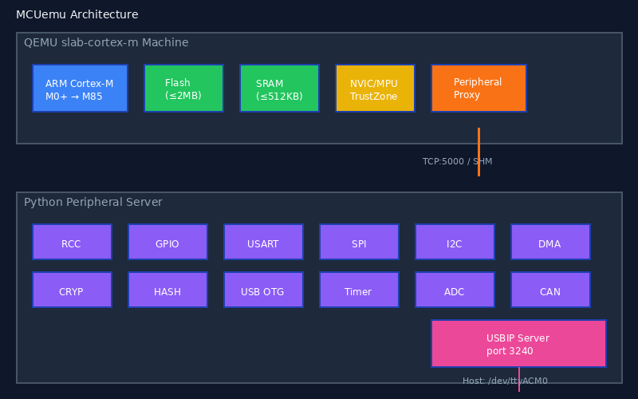

===================================================
SLAB -- Rehost ARM Cortex-M Firmware in Python
===================================================

**SLAB** (Software Lab) is a QEMU-based platform that rehosts ARM Cortex-M
firmware with full Python peripheral control. It enables firmware testing,
peripheral prototyping, and security research without physical hardware or
custom QEMU recompilation. A single ``slab-cortex-m`` QEMU machine supports
every Cortex-M variant from M0 to M85.

Supported MCUs
--------------

.. list-table::
   :header-rows: 1
   :widths: 20 50 30

   * - Vendor
     - MCU Families
     - Cortex Core
   * - **ST**
     - STM32F0, F1, F4, L4, H5, H7, U5, WB55
     - M0, M3, M4, M7, M33
   * - **Nordic**
     - nRF52840, nRF5340
     - M4, M33
   * - **NXP**
     - LPC55S69, i.MX RT1060
     - M33, M7
   * - **Raspberry Pi**
     - RP2040, RP2350
     - M0+, M33
   * - **Generic**
     - Any Cortex-M with SVD auto-stub
     - M0 -- M85

How It Works
------------

::

    +-------------+       TCP / SHM       +-------------------+
    |   QEMU      | <----- MMIO --------> |  Python Server    |
    |  Cortex-M   |    proxy protocol     |  (peripheral set) |
    |  firmware    | ------- IRQ --------> |                   |
    +-------------+                       +-------------------+
          |                                       |
     -kernel app.bin                     Board YAML + wiring
                                         External devices
                                         MMIO tracing

1. **QEMU** runs unmodified firmware on a generic ``slab-cortex-m`` machine.
2. Every **MMIO access** is forwarded to a Python peripheral server over TCP or shared memory.
3. Python **peripheral models** respond with register-accurate values, trigger IRQs, and drive external device logic.
4. A **board YAML** file wires MCU peripherals to external devices (flash, EEPROM, LCD, sensors).

Feature Highlights
------------------

* **SVD Auto-Stub** -- Load any SVD file to generate peripheral stubs automatically
* **Board YAML** -- Declarative board configuration with external device wiring
* **USBIP** -- Firmware-in-the-loop USB (DWC2 OTG, PMA FS, RP2040)
* **MMIO Tracing** -- Record, export (text/JSON/CSV), and analyze all peripheral accesses
* **Hardware-in-the-Loop** -- Forward selected peripherals to real silicon via pyOCD/SWD
* **TrustZone** -- ARMv8-M Secure/Non-Secure peripheral partitioning (STM32H5, U5)
* **Shared Memory** -- Zero-copy MMIO transport for high-throughput workloads
* **CI Runner** -- YAML-driven test scenarios with assertions and JUnit XML output

Quick Example
-------------

.. code-block:: python

   from slab_cortex_m.emulator import CortexM, CortexMConfig

   config = CortexMConfig(
       machine="STM32F405",
       firmware_path="app.bin",
       gdb_port=1234,          # optional GDB stub
   )
   emu = CortexM(config)
   emu.start()

   pc = emu.read_register("pc")   # read via GDB stub
   emu.set_breakpoint(0x0800_0100)
   emu.resume()

   emu.stop()

E2E Test Matrix
---------------

43 end-to-end firmware tests pass across 8 MCU families, 3 transport modes
(TCP, SHM, board), and multiple peripheral configurations.

.. list-table::
   :header-rows: 1
   :widths: 35 15 15 15

   * - Test
     - Mode
     - MMIO Ops
     - Status
   * - STM32F405 HelloBlink
     - legacy/board/shm
     - 222
     - PASS
   * - STM32F405 HelloBlinkUart
     - legacy/board/shm
     - 37K--67K
     - PASS
   * - STM32F405 SPI Flash
     - direct/board
     - 5--10
     - PASS
   * - STM32F405 I2C EEPROM
     - direct
     - 16
     - PASS
   * - STM32F405 SPI LCD
     - direct
     - 10
     - PASS
   * - STM32F439 Crypto CDC
     - direct/board/wookey/shm
     - 35K--76K
     - PASS
   * - STM32F439 DMA Flash
     - direct/board
     - 24--48
     - PASS
   * - STM32F439 RTC
     - direct/board
     - 6--12
     - PASS
   * - STM32L433 I2C EEPROM
     - direct/board
     - 23--46
     - PASS
   * - STM32F103 CDC Blinky
     - direct/board
     - 64--128
     - PASS
   * - STM32F411 CDC Blinky
     - direct/board
     - 475--950
     - PASS
   * - STM32U5A5 CDC Blinky
     - direct/board
     - 431--862
     - PASS
   * - nRF52840 EEPROM
     - direct/board/shm
     - 6--12
     - PASS
   * - nRF52840 Flash
     - direct/board/shm
     - 2--10
     - PASS
   * - nRF52840 QSPI
     - direct/board/shm
     - 12--24
     - PASS
   * - RP2040 EEPROM
     - direct
     - 9,408
     - PASS
   * - STM32H563 TZ Secure
     - direct/shm
     - 68--1,600
     - PASS
   * - Benchmark (M0/M3/M4/M7/M33)
     - direct
     - 237
     - PASS

Installation
------------

.. code-block:: bash

   # Python package
   cd slab/python
   pip install -e '.[dev]'

   # QEMU (one-time build)
   mkdir build && cd build
   ../configure --target-list=arm-softmmu
   ninja

Documentation
-------------

.. toctree::
   :maxdepth: 2
   :caption: Getting Started

   tutorials/quickstart
   tutorials/first_emulation
   tutorials/peripheral_basics

.. toctree::
   :maxdepth: 2
   :caption: Tutorials

   tutorials/svd_to_peripheral
   tutorials/creating_boards
   tutorials/server_modes
   tutorials/peripheral_hooks
   tutorials/adding_new_soc
   tutorials/stubbing_peripherals
   tutorials/mmio_tracing
   tutorials/ci_testing
   tutorials/adding_usb_support
   tutorials/creating_ui_peripherals
   tutorials/hardware_in_the_loop
   tutorials/debugging_bootloops
   tutorials/trustzone_emulation

.. toctree::
   :maxdepth: 2
   :caption: Architecture

   architecture/overview
   architecture/proxy_protocol
   architecture/peripheral_model

.. toctree::
   :maxdepth: 2
   :caption: API Reference

   api/slab_cortex_m
   api/slab_stm32
   api/slab_gui

.. toctree::
   :maxdepth: 1
   :caption: Additional Resources

   references
   changelog

Indices and tables
==================

* :ref:`genindex`
* :ref:`modindex`
* :ref:`search`
