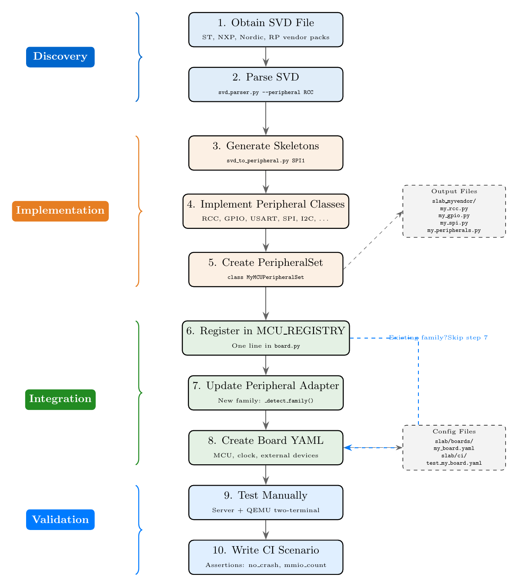

.. _adding_new_soc:

=========================
Adding a New SoC to SLAB
=========================

This tutorial walks you through the complete process of adding a new System-on-Chip
(SoC) to the SLAB MCU emulation platform. By the end, you will have a fully
integrated MCU with emulated peripherals, a board YAML configuration, and a CI test
scenario that proves the firmware boots and interacts with hardware correctly.

The process is divided into four phases and ten steps. We begin with discovery ---
obtaining and parsing the vendor SVD file --- then move through implementation of
peripheral classes, integration with the SLAB framework, and finally validation
through manual testing and CI automation.

   The complete workflow for adding a new SoC, from SVD file to CI tests.

Prerequisites
=============

Before starting, make sure you have:

- A working SLAB development environment (see :ref:`quickstart`)
- Python 3.10+ with ``pyyaml`` installed
- A built QEMU with the ``slab-cortex-m`` machine (``./build/qemu-system-arm``)
- The compiled firmware binary (``.bin``) you intend to emulate

.. tip::

   If you have never created a peripheral before, read :ref:`stubbing_peripherals`
   first. It introduces the base class interface and the ``(value, status)`` return
   convention that every SLAB peripheral uses.

==================================
Phase 1 --- Discovery (Steps 1-2)
==================================

Step 1: Obtain the SVD File
===========================

An SVD (System View Description) file is the single most important input for
adding a new SoC. It is an XML file, defined by the CMSIS standard, that describes
the entire peripheral register map of a microcontroller --- every peripheral, every
register, every bit field, and every reset value.

Where to Find SVD Files
-----------------------

.. list-table::
   :widths: 20 40 40
   :header-rows: 1

   * - Vendor
     - Source
     - Notes
   * - STMicroelectronics
     - `stm32-rs on GitHub <https://github.com/stm32-rs/stm32-rs>`_
     - Community-maintained, patched SVDs. Also available in Keil DFPs.
   * - NXP
     - `MCUXpresso SDK <https://www.nxp.com/mcuxpresso>`_
     - Download the SDK for your device; SVDs are inside the ``devices/`` tree.
   * - Nordic Semiconductor
     - `nrfx/mdk on GitHub <https://github.com/NordicSemiconductor/nrfx>`_
     - SVDs live in ``mdk/``. Covers nRF52, nRF53, and nRF91 families.
   * - Raspberry Pi
     - `pico-sdk on GitHub <https://github.com/raspberrypi/pico-sdk>`_
     - SVD for RP2040 is in ``src/rp2040/hardware_regs/``.

Once you have the file, place it somewhere convenient --- for example,
``slab/svd/my_mcu.svd``.

SVD Format Overview
-------------------

An SVD file is plain XML. At a high level it contains:

- **Device metadata**: CPU type (Cortex-M0, M4, M33, ...), endianness, address width
- **Peripherals**: Each with a name, base address, and size
- **Registers**: Each with an offset from the peripheral base, a reset value, and
  an access type (read-only, write-only, read-write)
- **Fields**: Individual bits or bit ranges within registers, with names and widths

You do not need to read the XML by hand. The next step shows how to parse it
programmatically.

.. note::

   For a deeper treatment of SVD parsing and how to turn register definitions into
   Python peripheral classes, see :ref:`svd_to_peripheral`.

Step 2: Parse the SVD File
==========================

SLAB ships with a built-in SVD parser that can list peripherals, dump register
maps, and even generate YAML configuration snippets.

Listing Peripherals
-------------------

Run the parser in list mode to see every peripheral the SVD defines:

.. code-block:: bash

   PYTHONPATH=slab/python python3 -m slab_cortex_m.svd_parser my_mcu.svd --list-peripherals

Example output:

.. code-block:: text

   Device: MyMCU123
   CPU: CM4
   Peripherals: 42

   Name            Base        Registers
   RCC             0x40023800  25
   GPIOA           0x40020000  10
   GPIOB           0x40020400  10
   SPI1            0x40013000  9
   USART1          0x40011000  8
   I2C1            0x40005400  7
   TIM2            0x40000000  20
   ...

This gives you the full inventory of what the MCU contains, along with the base
addresses your peripheral classes will need.

Generating a YAML Configuration Snippet
----------------------------------------

You can export the peripheral list to a YAML skeleton:

.. code-block:: bash

   PYTHONPATH=slab/python python3 -m slab_cortex_m.svd_parser my_mcu.svd --yaml > config.yaml

The resulting file contains peripheral names and base addresses, which you can
reference later when building your ``PeripheralSet``.

Inspecting a Single Peripheral
------------------------------

To drill into the register map of a specific peripheral:

.. code-block:: bash

   PYTHONPATH=slab/python python3 -m slab_cortex_m.svd_parser my_mcu.svd --peripheral RCC

This prints every register with its offset, reset value, access type, and all
bit-field definitions --- exactly the data you need for the implementation phase.

=======================================
Phase 2 --- Implementation (Steps 3-5)
=======================================

Step 3: Generate Peripheral Skeletons
=====================================

SLAB includes a code-generation tool that reads an SVD file and outputs a Python
class skeleton for a given peripheral. This saves you from manually transcribing
hundreds of register offsets and bit masks.

Generating a Single Skeleton
-----------------------------

.. code-block:: bash

   python3 slab/tools/svd_to_peripheral.py my_mcu.svd RCC

Example output (abbreviated):

.. code-block:: python

   class MyMCURCC(STM32Peripheral):
       """Reset and Clock Control"""

       # Register offsets
       CR        = 0x00
       PLLCFGR   = 0x04
       CFGR      = 0x08
       CIR       = 0x0C
       AHB1RSTR  = 0x10
       AHB2RSTR  = 0x14
       APB1RSTR  = 0x20
       APB2RSTR  = 0x24
       AHB1ENR   = 0x30
       AHB2ENR   = 0x34
       APB1ENR   = 0x40
       APB2ENR   = 0x44

       # CR bits
       CR_HSION     = 1 << 0
       CR_HSIRDY    = 1 << 1
       CR_HSEON     = 1 << 16
       CR_HSERDY    = 1 << 17
       CR_PLLON     = 1 << 24
       CR_PLLRDY    = 1 << 25

       # CFGR bits
       CFGR_SW_MASK   = 0x3 << 0
       CFGR_SWS_MASK  = 0x3 << 2

       def __init__(self, base):
           super().__init__("RCC", base, size=0x400)
           # TODO: set reset values and implement behavior

       def _read_reg(self, offset, size):
           return self.regs.get(offset, 0)

       def _write_reg(self, offset, size, value):
           self.regs[offset] = value

Batch Generation
----------------

To generate skeletons for every peripheral at once:

.. code-block:: bash

   python3 slab/tools/svd_to_peripheral.py my_mcu.svd --all --outdir stubs/

This creates one Python file per peripheral inside the ``stubs/`` directory. The
skeletons are valid Python --- they compile and run immediately --- but they have no
behavior beyond storing and returning register values. The next step adds that.

Step 4: Implement Peripheral Classes
=====================================

The skeleton from Step 3 gives you the register layout; now you need to fill in the
*behavior*. The general pattern is:

- ``_read_reg(offset, size)`` returns the current register value. For status
  registers, compute the value dynamically from internal state.
- ``_write_reg(offset, size, value)`` stores the value and triggers any side
  effects (enable clocks, start transfers, raise interrupts).

Minimal RCC Example
-------------------

The RCC (Reset and Clock Control) peripheral is almost always the first one firmware
touches, because it configures the system clock. Here is a minimal but functional
implementation:

.. code-block:: python

   from slab_stm32.stm32_base import STM32Peripheral

   class MyMCURCC(STM32Peripheral):
       """Reset and Clock Control for MyMCU."""

       # Register offsets
       CR      = 0x00
       CFGR    = 0x08
       AHB1ENR = 0x30
       APB1ENR = 0x40
       APB2ENR = 0x44

       # CR bits
       CR_HSION  = 1 << 0
       CR_HSIRDY = 1 << 1
       CR_HSEON  = 1 << 16
       CR_HSERDY = 1 << 17
       CR_PLLON  = 1 << 24
       CR_PLLRDY = 1 << 25

       # CFGR bits
       CFGR_SW_MASK  = 0x3
       CFGR_SWS_MASK = 0x3 << 2

       def __init__(self, base=0x40023800):
           super().__init__("RCC", base, size=0x400)
           # HSI is on and ready at reset
           self.regs[self.CR] = self.CR_HSION | self.CR_HSIRDY

       def _read_reg(self, offset, size):
           """Return register value; status bits are computed live."""
           if offset == self.CR:
               return self._compute_cr()
           elif offset == self.CFGR:
               return self._compute_cfgr()
           return self.regs.get(offset, 0)

       def _write_reg(self, offset, size, value):
           """Store value and trigger side effects."""
           self.regs[offset] = value

           if offset == self.CR:
               # Auto-set ready flags when oscillators are enabled
               if value & self.CR_HSEON:
                   self.regs[self.CR] |= self.CR_HSERDY
               if value & self.CR_PLLON:
                   self.regs[self.CR] |= self.CR_PLLRDY

       def _compute_cr(self):
           """CR register with ready bits reflecting enable state."""
           cr = self.regs.get(self.CR, 0)
           if cr & self.CR_HSION:
               cr |= self.CR_HSIRDY
           return cr

       def _compute_cfgr(self):
           """Mirror SW into SWS (firmware expects the switch to succeed)."""
           cfgr = self.regs.get(self.CFGR, 0)
           sw = cfgr & self.CFGR_SW_MASK
           cfgr = (cfgr & ~self.CFGR_SWS_MASK) | (sw << 2)
           return cfgr

The key insight is that firmware polls ready flags (``HSERDY``, ``PLLRDY``) after
enabling oscillators. If the emulated RCC never sets those flags, the firmware will
spin forever. The implementation above sets them immediately, which is a reasonable
approximation for most use cases.

Naming Convention --- Versioned Classes
----------------------------------------

Different MCU families sometimes share the same peripheral IP block (for example,
STM32F4 and STM32F7 both use "SPI version 1"). SLAB uses versioned class names to
enable reuse:

- ``STM32RCCv2`` --- RCC register layout version 2 (F4/F7)
- ``STM32SPIv1`` --- SPI register layout version 1 (F1/F4/F7)
- ``STM32USARTv2`` --- USART layout version 2 (L4/H5)

When you add a peripheral for a new SoC, check whether its register layout matches
an existing version. If it does, you can reuse the class directly and only need to
supply the correct base address.

.. tip::

   For a step-by-step guide on the ``_read_reg`` / ``_write_reg`` pattern and how
   to add callbacks for external devices, see :ref:`stubbing_peripherals`.

Step 5: Create the PeripheralSet
=================================

A ``PeripheralSet`` is the top-level container that groups all peripherals for a
specific SoC. It provides a unified ``read()`` / ``write()`` interface that dispatches
MMIO accesses to the correct peripheral based on address.

Follow the pattern in ``slab/python/slab_stm32/stm32f4xx.py``:

.. code-block:: python

   import logging

   class MyMCU123PeripheralSet:
       """Peripheral set for the MyMCU123 SoC."""

       def __init__(self, log=None):
           self.name = "MyMCU123"
           self.log = log or logging.getLogger(self.name)
           self._peripherals = {}
           self.irq_callback = None

           self._create_clock_system()
           self._create_gpio()
           self._create_communication()

       # ----- Peripheral groups -----

       def _create_clock_system(self):
           self.rcc = MyMCURCC(base=0x40023800)
           self._peripherals['RCC'] = self.rcc

       def _create_gpio(self):
           gpio_bases = {
               'A': 0x40020000,
               'B': 0x40020400,
               'C': 0x40020800,
           }
           self.gpio = {}
           for port, base in gpio_bases.items():
               from slab_stm32.stm32_gpio import STM32GPIOv2
               self.gpio[port] = STM32GPIOv2(port=port, base=base)
               self._peripherals[f'GPIO{port}'] = self.gpio[port]

       def _create_communication(self):
           from slab_stm32.stm32_usart import STM32USARTv1
           self.usart1 = STM32USARTv1(index=1, base=0x40011000)
           self._peripherals['USART1'] = self.usart1

           from slab_stm32.stm32_spi import STM32SPIv1
           self.spi1 = STM32SPIv1(index=1, base=0x40013000)
           self._peripherals['SPI1'] = self.spi1

       # ----- Dispatch interface -----

       @property
       def peripherals(self):
           return self._peripherals

       def add_peripheral(self, name, periph):
           self._peripherals[name] = periph

       def find_peripheral(self, addr):
           for p in self._peripherals.values():
               if hasattr(p, 'contains') and p.contains(addr):
                   return p
           return None

       def read(self, addr, size):
           p = self.find_peripheral(addr)
           if p:
               return p.read(addr, size)
           return (0, 0)

       def write(self, addr, size, value):
           p = self.find_peripheral(addr)
           if p:
               return p.write(addr, size, value)
           return 0

Categorize your peripherals into ``_create_*()`` methods (clock, GPIO, communication,
timers, analog, DMA, misc) for readability. This is the same pattern used by every
existing SLAB peripheral set.

.. warning::

   The ``read()`` method must return a ``(value, status)`` tuple, where ``status=0``
   means OK. If your peripheral set returns a raw integer instead, you will need to
   update the peripheral adapter (Step 7) to wrap the return value.

======================================
Phase 3 --- Integration (Steps 6-8)
======================================

Step 6: Register in MCU_REGISTRY
=================================

With the peripheral set implemented, you need to register it so that the board
builder can find it by name.

Open ``slab/python/slab_cortex_m/board.py`` and add one line to the ``MCU_REGISTRY``
dictionary (around line 58):

.. code-block:: python

   MCU_REGISTRY = {
       # ...existing entries...

       # MyVendor
       "MYMCU123":   ("slab_myvendor", "MyMCU123PeripheralSet", "cortex-m4", 120_000_000),
   }

The tuple has four elements:

1. **Package name** --- the Python package containing your ``PeripheralSet`` class
   (e.g., ``slab_myvendor``). This is the argument to ``importlib.import_module()``.
2. **Class name** --- the exact class name, retrieved with ``getattr()``.
3. **QEMU CPU type** --- one of: ``cortex-m0``, ``cortex-m3``, ``cortex-m4``,
   ``cortex-m7``, ``cortex-m23``, ``cortex-m33``, ``cortex-m55``.
4. **Default clock in Hz** --- used when the board YAML does not specify a ``clock``.

After this change, ``create_peripheral_set('MYMCU123')`` will dynamically import
your package and instantiate the peripheral set.

.. note::

   Make sure your package directory has an ``__init__.py`` that exports the
   peripheral set class. For example:

   .. code-block:: python

      # slab/python/slab_myvendor/__init__.py
      from .mymcu123 import MyMCU123PeripheralSet

      __all__ = ['MyMCU123PeripheralSet']

Step 7: Update the Peripheral Adapter (if New Family)
=====================================================

.. note::

   If you are adding a new MCU within an existing family (e.g., another STM32,
   another nRF, another LPC, or another RP device), you can **skip this step
   entirely**. The adapter already knows how to handle STM32, NRF, NXP, and RP2040
   peripherals.

The ``PeripheralSetAdapter`` in ``slab/python/slab_cortex_m/peripheral_adapter.py``
normalizes the different calling conventions of each vendor's peripheral set into the
uniform ``(value, status)`` tuple that the SLAB server expects. If your new SoC
belongs to a vendor family that the adapter does not yet recognize, you need to make
three small changes.

Change 1 --- ``_detect_family()``
----------------------------------

Add a branch that recognizes your class name:

.. code-block:: python

   def _detect_family(self) -> str:
       cls_name = type(self.pset).__name__
       if 'STM32' in cls_name:
           return 'stm32'
       elif 'NRF' in cls_name or 'nRF' in cls_name:
           return 'nrf'
       elif 'NXP' in cls_name or 'LPC' in cls_name or 'IMXRT' in cls_name:
           return 'nxp'
       elif 'RP20' in cls_name:
           return 'rp2040'
       elif 'MyVendor' in cls_name:       # <-- new
           return 'myvendor'              # <-- new
       return 'unknown'

Change 2 --- ``read()``
------------------------

Add a dispatch branch for the new family. The critical question is: does your
``PeripheralSet.read()`` return a ``(value, status)`` tuple or a raw integer?

.. code-block:: python

   def read(self, addr, size, secure=True):
       # ...existing branches...
       elif self.family == 'myvendor':
           # MyVendor returns (value, status) tuples, same as STM32
           return self.pset.read(addr, size)

If your peripheral set returns a raw integer instead, wrap it:

.. code-block:: python

       elif self.family == 'myvendor':
           value = self.pset.read(addr, size)
           return (value if isinstance(value, int) else 0, STATUS_OK)

Change 3 --- ``_setup_irq_forwarding()``
-----------------------------------------

Add your family to the correct IRQ group. If your peripheral set uses the
``irq_callback(irq_num, level)`` convention (same as STM32), add it to that group:

.. code-block:: python

   def _setup_irq_forwarding(self):
       if self.family in ('stm32', 'rp2040', 'myvendor'):  # <-- add here
           # ...existing code...

If it uses a different convention, follow the ``nrf``/``nxp`` pattern.

Step 8: Create a Board YAML
============================

The board YAML ties everything together: it names the MCU, declares external devices,
and optionally overrides the memory layout.

Create ``slab/boards/my_board.yaml``:

.. code-block:: yaml

   name: MyMCU123_Blinky
   mcu: MYMCU123
   clock: 120000000

   external_devices:
     - type: LED
       bus: GPIOA
       params: {pin: 5, color: green}

     - type: W25Q128
       bus: SPI1
       params: {}

The ``mcu`` field must exactly match a key in ``MCU_REGISTRY``. The ``bus`` field
must match a peripheral name that your ``PeripheralSet`` exposes (e.g., ``GPIOA``,
``SPI1``, ``I2C1``).

QEMU Memory Layout Overrides
-----------------------------

If your SoC uses a non-standard memory layout (i.e., flash does not start at
``0x08000000``), add a ``qemu_extra`` section:

.. code-block:: yaml

   qemu_extra:
     flash-base: "0x08000000"
     sram-base: "0x20000000"
     sram-size: "0x40000"
     sysclk-hz: "120000000"

.. warning::

   All ``qemu_extra`` values **must be quoted strings** in YAML. They are passed
   as-is to the QEMU ``-M`` machine option (e.g.,
   ``-M slab-cortex-m,flash-base=0x08000000``). Unquoted hex values like
   ``0x08000000`` will be parsed by YAML as integers, which causes errors.

======================================
Phase 4 --- Validation (Steps 9-10)
======================================

Step 9: Test Manually
=====================

Before writing CI automation, verify that everything works by running QEMU and the
peripheral server side by side.

Terminal 1 --- Start the Peripheral Server
-------------------------------------------

.. code-block:: bash

   PYTHONPATH=slab/python python3 -c "
   from slab_cortex_m.board import load_board_config, create_peripheral_set
   from slab_cortex_m.peripheral_adapter import PeripheralSetAdapter
   from slab_cortex_m.base_server import BasePeripheralServer

   config = load_board_config('slab/boards/my_board.yaml')
   pset = create_peripheral_set(config)
   adapter = PeripheralSetAdapter(pset)

   server = BasePeripheralServer(port=5555)
   server.adapter = adapter
   print('Peripheral server listening on port 5555...')
   server.serve_forever()
   "

Terminal 2 --- Start QEMU
--------------------------

.. code-block:: bash

   ./build/qemu-system-arm \
       -M slab-cortex-m,cpu-type=cortex-m4,tcp-port=5555 \
       -kernel firmware.bin \
       -nographic

What to Look For
----------------

In the server terminal you should see a stream of MMIO transactions:

.. code-block:: text

   [INFO] WRITE 0x40023800 4 0x00000001  (RCC CR)
   [INFO] READ  0x40023800 4 -> 0x00000003
   [INFO] WRITE 0x40020000 4 0x55000000  (GPIOA MODER)
   ...

If the firmware boots and reaches its main loop, you will see a steady pattern of
GPIO writes (for a blinky) or SPI/I2C transactions (for communication demos).

Common problems at this stage:

- **No MMIO activity** --- check that the TCP port matches between server and QEMU.
- **Firmware spins on a register poll** --- the peripheral is not returning the
  expected ready flag. Add a ``print()`` in ``_read_reg`` to see what the firmware is
  waiting for, then update your peripheral implementation.
- **QEMU exits immediately** --- the memory layout is wrong. Double-check
  ``flash-base`` and ``sram-base`` in ``qemu_extra``.

Step 10: Write a CI Scenario
=============================

Once the firmware runs manually, automate it with a CI scenario.

Create ``slab/ci/test_my_board.yaml``:

.. code-block:: yaml

   # MyMCU123 Blinky CI Test
   scenarios:
     - name: mymcu123_blinky
       board: slab/boards/my_board.yaml
       firmware: path/to/firmware.bin
       timeout: 10
       assertions:
         - type: no_crash
         - type: mmio_count
           params: {min: 50}

Run the test:

.. code-block:: bash

   PYTHONPATH=slab/python python3 -m slab_cortex_m.ci_runner \
       --scenario slab/ci/test_my_board.yaml \
       --qemu ./build/qemu-system-arm

Expected output:

.. code-block:: text

   [INFO] Running 1 scenario(s)
   [INFO] Running: mymcu123_blinky
   [INFO]   PASS (10.0s, 187 MMIO ops)
   [INFO]     [+] no_crash: QEMU exit code: 0
   [INFO]     [+] mmio_count(>=50): count=187
   [INFO] RESULTS: 1/1 passed

For more assertion types (``gpio_toggle``, ``uart_output``) and batch mode, see
:ref:`ci_testing`.

===============
Common Pitfalls
===============

Even experienced developers run into these issues when adding a new SoC. Check this
list if something is not working as expected.

1. **Register read must return a ``(value, status)`` tuple, not a raw integer.**
   The SLAB server protocol expects ``read()`` to return ``(value, 0)`` where the
   second element is a status code (0 = OK). If your peripheral returns a bare
   integer, the server will misinterpret it and QEMU will read garbage values.
   If you cannot change the peripheral, update the adapter (Step 7) to wrap the
   return value.

2. **``find_peripheral()`` uses ``contains(addr)`` --- make sure your base class
   implements it.**
   The ``contains()`` method checks whether an address falls within
   ``[base, base + size)``. If your peripheral class does not inherit from a base
   that provides this method, ``find_peripheral()`` will silently skip it and all
   reads to that peripheral will return zero.

3. **``qemu_extra`` values must be quoted strings in YAML.**
   Write ``flash-base: "0x08000000"`` (with quotes), not ``flash-base: 0x08000000``.
   YAML will silently parse the unquoted hex literal as an integer, and the QEMU
   command-line builder will produce ``flash-base=134217728`` instead of the expected
   hex string.

4. **Do not forget to create ``__init__.py`` with exports in your new package.**
   The board builder uses ``importlib.import_module(pkg_name)`` followed by
   ``getattr(pkg, cls_name)``. If your ``__init__.py`` does not import and export
   the peripheral set class, ``getattr`` will raise an ``AttributeError``.

5. **Port numbers must match between server and QEMU ``tcp-port``.**
   If the peripheral server listens on port 5555, the QEMU ``-M`` option must
   include ``tcp-port=5555``. A mismatch causes QEMU to connect to nothing and
   the firmware to hang on the first MMIO access.

6. **Reset values matter.**
   Many peripherals have non-zero reset values (for example, USART status registers
   often report "TX empty" at reset). If you forget to initialize these, firmware
   may hang waiting for a flag that will never be set. Always check the SVD
   ``resetValue`` for each register.

==========
Next Steps
==========

Congratulations --- you have added a new SoC to SLAB. Here are some directions
to explore next:

- :ref:`adding_usb_support` --- Add USB device emulation to your SoC
- :ref:`mmio_tracing` --- Capture and analyze every peripheral access for
  debugging and reverse engineering
- :ref:`ci_testing` --- Advanced CI assertions, batch mode, and GitHub Actions
  integration

.. note::

   Author: Mathieu Renard <mathieu.renard@twistedwires.io>

   Copyright (C) 2026 Twisted Wires Security Lab
