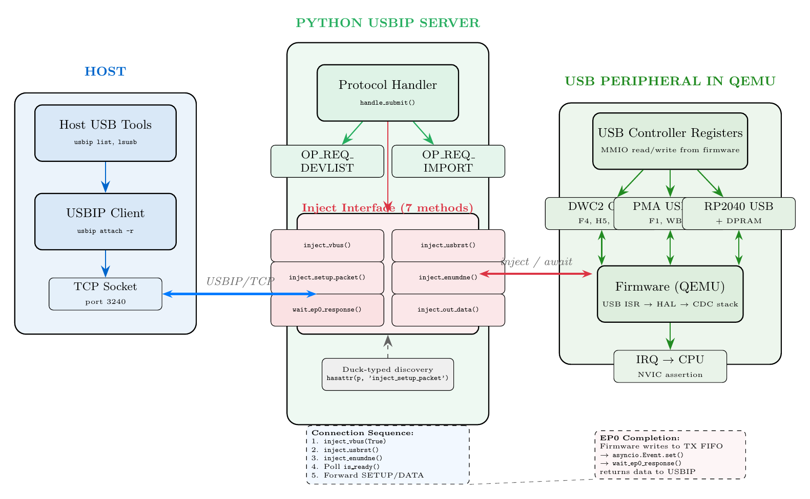

.. _adding_usb_support:

========================================
Adding USB/USBIP Support to a New SoC
========================================

This tutorial walks you through the process of adding USB firmware-in-the-loop
support to a new SoC in the SLAB MCU emulation platform. By the end, you will
understand how the USBIP bridge works, how to implement the inject interface on
your USB peripheral, and how to test the result end-to-end with real USB tools.

The tutorial assumes you have already read :ref:`peripheral_basics` and
:ref:`creating_boards`, and that you have a working register-level model for
your SoC's USB controller.

Author: Mathieu Renard <mathieu.renard@twistedwires.io>

Copyright (C) 2026 Twisted Wires Security Lab

Architecture Overview
=====================

Before writing any code, it is important to understand *why* the USBIP bridge
exists and what role it plays in the emulation stack.

When you emulate a microcontroller, the firmware running inside QEMU believes
it is talking to real USB hardware. It configures clock trees, enables
interrupts, writes to control registers, and fills transmit buffers -- all
through MMIO. On real silicon, a physical USB cable carries those packets to a
host PC. In emulation, there is no cable. The USBIP bridge fills that gap: it
presents a virtual USB device to the host operating system so that standard
tools -- ``lsusb``, ``usbip``, ``minicom`` -- work as if a real device were
plugged in.

The data flow looks like this:

.. code-block:: text

   Host USB tools              SLAB Emulation Stack
   ===============              ====================
   lsusb / usbip   <--USBIP--> USBIPServer (Python)
                                     |
                                inject_setup_packet()
                                wait_ep0_response()
                                inject_out_data()
                                     |
                                USB Peripheral (register model)
                                     |
                                MMIO read/write (QEMU)
                                     |
                                Firmware (ISR, HAL)

   Data flow from host USB tools through the USBIP bridge to emulated firmware.

Two Modes of Operation
----------------------

The USBIP server supports two modes:

1. **Standalone fallback.** When no USB peripheral is linked, the server uses a
   built-in ``CDCACMDevice`` class that answers USB requests directly in Python.
   This is useful for testing the USBIP protocol layer without any firmware.

2. **Firmware-in-the-loop.** When a USB peripheral *is* linked (via
   ``set_usb_peripheral()``), the server forwards every SETUP packet to the
   peripheral using the inject interface. The firmware running inside QEMU
   processes the request, prepares a response, and writes it to a transmit
   buffer. The peripheral model detects the write and signals the server, which
   sends the response back to the host over USBIP.

The second mode is the one you are implementing when you add USB support to a
new SoC. The first mode exists so that the USBIP server can run standalone for
quick smoke tests.

The Inject Interface
====================

The heart of the integration is the **inject interface** -- a set of seven
methods that your USB peripheral class must implement. These methods are the
contract between the USBIP server and your register-level model.

The ``USBDeviceProtocol`` is defined conceptually in
``slab/python/slab_peripherals/usb_controller.py``, but the USBIP server
discovers your peripheral by duck typing (see next section). You do not need to
inherit from any base class. You simply need to implement the methods.

.. list-table:: USBDeviceProtocol Methods
   :widths: 25 10 35 30
   :header-rows: 1

   * - Method
     - Sync
     - Signature
     - Purpose
   * - ``inject_vbus``
     - Sync
     - ``(connected: bool) -> None``
     - Simulate USB cable plug/unplug. Set VBUS detect status bits, fire session request interrupt.
   * - ``inject_usbrst``
     - Sync
     - ``() -> None``
     - Inject USB bus reset. Set reset interrupt flag, clear device address.
   * - ``inject_enumdne``
     - Sync
     - ``() -> None``
     - Signal enumeration done. Set speed in status register. No-op for PMA USB and RP2040 (controller has no such event).
   * - ``inject_setup_packet``
     - Sync
     - ``(setup_data: bytes) -> None``
     - Write 8-byte SETUP packet to EP0 receive buffer (FIFO, PMA, or DPRAM). Set SETUP interrupt flag.
   * - ``wait_ep0_response``
     - **Async**
     - ``(timeout: float) -> bytes``
     - Wait for firmware to fill EP0 IN buffer. Returns response bytes. Uses ``asyncio.Event`` internally.
   * - ``inject_out_data``
     - Sync
     - ``(ep: int, data: bytes) -> None``
     - Write OUT data (or ZLP) to an endpoint buffer. Set transfer-complete flags.
   * - ``is_ready``
     - Sync
     - ``() -> bool``
     - Check if firmware has initialized USB (clocks enabled, interrupts configured, not in reset). Optional but recommended.

.. note::

   All synchronous inject methods must be safe to call from an ``asyncio``
   context (they must not block). They manipulate register state and trigger
   IRQs, but they do not wait for firmware. Only ``wait_ep0_response`` is a
   coroutine that blocks until the firmware writes its reply.

Why seven methods instead of one big "handle USB packet" function? Because USB
enumeration is a multi-phase process. The host asserts VBUS, waits, sends a bus
reset, waits again, negotiates speed, and only then begins sending SETUP
packets. Each phase triggers a different interrupt in the firmware. By exposing
each phase as a separate method, the USBIP server can inject delays between
them, giving the firmware time to process each step -- exactly as real hardware
would.

Discovery Mechanism
===================

The USBIP server does not require you to register your USB peripheral in a
global table. Instead, it uses **duck typing**: it iterates over all
peripherals in the server and checks whether each one has the two critical
methods.

The discovery code lives in ``slab/python/slab_cortex_m/mcuemu_server.py``:

.. code-block:: python

   def _find_usb_peripheral(self):
       """Find any USB peripheral with USBIP inject interface."""
       for p in self.peripherals:
           if hasattr(p, 'inject_setup_packet') and hasattr(p, 'wait_ep0_response'):
               return p
       return None

This means:

- You do not need to add your class to any registry or configuration file.
- You do not need to inherit from a specific base class.
- You simply implement the seven methods on your peripheral class.
- Your peripheral must be part of your MCU's ``PeripheralSet`` so that it
  appears in the list of peripherals the server iterates over.

.. tip::

   If discovery fails (``_find_usb_peripheral`` returns ``None``), the server
   will log a warning and fall back to the standalone ``CDCACMDevice``. The most
   common cause is forgetting to add your USB peripheral to the MCU's
   ``PeripheralSet`` class.

Connection Sequence
===================

Understanding *when* and *how* the inject methods are called is essential for
getting the timing right. The USBIP server injects a carefully ordered
connection sequence when a client imports the virtual device. This happens in
the ``handle_import()`` method of ``slab/python/slab_cortex_m/usbip_server.py``.

The reason for this sequence is that USB enumeration on real hardware is a
multi-step handshake. The host asserts power on the cable (VBUS), waits for
the device to power up, sends a bus reset to bring the device into a known
state, negotiates the link speed, and only then begins the SETUP phase. If
any step is skipped or too fast, the firmware will not initialize correctly
and will fail to respond to SETUP packets.

The sequence is as follows:

1. **Poll ``is_ready()``** for up to 10 seconds (100 iterations, 100 ms each).
   This waits for the firmware to finish its USB initialization: enabling
   clocks, configuring the USB transceiver (``GCCFG`` on DWC2, ``USB_CNTR``
   on PMA), and enabling interrupts. If the timeout expires, the server
   proceeds anyway with a warning.

2. **``inject_vbus(True)``** -- cable connected. On DWC2, this sets
   ``GOTGCTL.BSVLD`` and fires ``GINTSTS.SRQINT``. On PMA USB, this is
   typically a no-op (the controller has no VBUS detect logic). The server
   then waits **300 ms** for the firmware to process the event.

3. **``inject_usbrst()``** -- bus reset. This sets the reset interrupt flag
   (``GINTSTS.USBRST`` on DWC2, ``USB_ISTR.RESET`` on PMA). The firmware's
   reset handler re-initializes all endpoints, flushes FIFOs, and opens EP0.
   The server waits **500 ms**.

4. **``inject_enumdne()``** -- enumeration done. On DWC2, this sets
   ``GINTSTS.ENUMDNE`` and the speed field in ``DSTS``. On PMA USB and RP2040,
   this is a no-op because those controllers do not have a separate enumeration
   done event. The server waits **500 ms**.

5. **Poll ``is_ready()``** again for up to 5 seconds. This confirms the
   firmware has processed the reset and enumeration sequence and is ready to
   receive SETUP packets.

.. code-block:: python

   # Simplified from usbip_server.py handle_import()

   # 1. Wait for firmware USB init
   for _ in range(100):
       if self.usb_peripheral.is_ready():
           break
       await asyncio.sleep(0.1)

   # 2. VBUS connected
   self.usb_peripheral.inject_vbus(connected=True)
   await asyncio.sleep(0.3)

   # 3. Bus reset
   self.usb_peripheral.inject_usbrst()
   await asyncio.sleep(0.5)

   # 4. Enumeration done
   self.usb_peripheral.inject_enumdne()
   await asyncio.sleep(0.5)

   # 5. Wait for post-reset init
   for _ in range(50):
       if self.usb_peripheral.is_ready():
           break
       await asyncio.sleep(0.1)

After this sequence completes, the USBIP server sends the ``OP_REP_IMPORT``
response to the client. From this point on, every SETUP packet from the host is
forwarded to the firmware via ``inject_setup_packet()``, and every IN response
is collected via ``wait_ep0_response()``.

.. warning::

   The delays (300 ms, 500 ms) are chosen to work with typical HAL-based
   firmware. If your firmware is slower (e.g., it reconfigures PLLs during the
   reset handler), you may need to increase these values. If the firmware does
   not respond to SETUP packets after import, the first thing to check is
   whether it had enough time to process the reset sequence.

EP0 Completion Hook -- The Hardest Part
========================================

This section describes the most complex piece of the USB integration. Every
other inject method is straightforward: you write some registers and fire an
interrupt. But detecting when the firmware has *finished* preparing its response
to a SETUP packet -- that requires understanding how the firmware's transmit
path works at the register level.

The Pattern
-----------

The general pattern is the same across all three existing implementations:

1. The USBIP server calls ``inject_setup_packet(setup_data)``.
2. Your peripheral writes the SETUP data to the EP0 receive buffer and fires
   the appropriate interrupt (RXFLVL on DWC2, CTR on PMA, BUFF_STATUS on
   RP2040).
3. QEMU delivers the interrupt. The firmware's ISR runs.
4. The firmware parses the SETUP packet, prepares a response (e.g., a device
   descriptor), and writes it to the EP0 transmit buffer.
5. Your peripheral model detects the write (in your ``_write_reg()`` or FIFO
   write handler) and signals an ``asyncio.Event``.
6. ``wait_ep0_response()`` was awaiting that Event. It returns the data.
7. The USBIP server sends the data back to the host.

The difficulty is step 5: *how* does your peripheral detect that the firmware
has finished writing to the transmit buffer? The answer depends on the USB
controller architecture.

DWC2 OTG (STM32F4/H5/U5)
-------------------------

The DWC2 OTG controller uses a FIFO-based transmit path. The firmware writes
data to a TX FIFO mapped at a fixed memory offset (``0x1000`` for EP0,
``0x2000`` for EP1, etc.).

The detection mechanism:

- When the firmware sets ``DIEPCTL0.EPENA`` (bit 31), it also programs
  ``DIEPTSIZ0`` with the transfer size. The peripheral model reads
  ``DIEPTSIZ0`` and stores the byte count in ``_tx_pending[0]``.
- Each 32-bit FIFO write decrements ``_tx_pending[0]`` by 4.
- When ``_tx_pending[0]`` reaches zero, the transfer is complete. The model
  sets ``DIEPINT0.XFRC`` (transfer complete bit) and calls
  ``_complete_ep0_transfer()``.
- ``_complete_ep0_transfer()`` reads the accumulated bytes from the TX buffer,
  trims them to the programmed transfer length, and sets ``_ep0_event``.

.. code-block:: python

   # From usb_cdc_peripheral.py -- DWC2 FIFO write handler

   if 0x1000 <= offset < 0x20000:
       ep = (offset - 0x1000) // 0x1000
       self.handle_tx_data(ep, value)
       if ep in self._tx_pending:
           self._tx_pending[ep] -= 4
           if self._tx_pending[ep] <= 0:
               del self._tx_pending[ep]
               self.regs[self.DIEPINT0 + ep * 0x20] |= 0x01  # XFRC
               if ep == 0:
                   self._complete_ep0_transfer()

PMA USB (STM32F1/WB55)
----------------------

The PMA (Packet Memory Area) controller does not have FIFOs. Instead, the
firmware writes response data directly to a buffer in PMA, then toggles the
endpoint status to VALID by writing to the ``EP0R`` register.

The detection mechanism:

- ``_write_epr()`` detects when ``STAT_TX`` transitions to ``VALID``.
- If ``STAT_TX`` becomes ``VALID`` and ``_ep0_event`` is pending (meaning the
  USBIP server is waiting for a response), the model calls
  ``_handle_ep0_tx_ready()``.
- ``_handle_ep0_tx_ready()`` reads the response from the PMA buffer. The
  buffer address is found in the BTABLE (buffer descriptor table). It reads
  the TX count from the BTABLE entry and the data from the TX buffer address.
- After reading the data, it signals ``_ep0_event``.

.. code-block:: python

   # From stm32_usb_device.py -- EPR write handler

   # USBIP hook: detect when firmware arms EP0 TX (STAT_TX -> VALID)
   if ep == 0 and state.tx_status == EPStatBits.VALID and self.connected:
       if self._ep0_event:
           self._handle_ep0_tx_ready()

RP2040 USB
----------

The RP2040 USB controller uses a DPRAM (Dual-Port RAM) for both buffer
descriptors and data buffers. The firmware writes data to a buffer in DPRAM,
then sets the ``FULL`` bit in the corresponding buffer control register.

The detection mechanism:

- ``RP2040USBDPRAM._write_reg()`` monitors writes to buffer control registers
  in the DPRAM region (offsets ``0x80``--``0xFF``).
- When the firmware writes a buffer control word with the ``FULL`` bit (bit 15)
  set on the EP0 IN buffer control register, it calls
  ``_usb_ctrl._handle_ep0_in_ready()``.
- ``_handle_ep0_in_ready()`` reads the data from DPRAM at the EP0 IN buffer
  offset (``0x100``) using the length from the buffer control register, then
  signals ``_ep0_event``.

.. code-block:: python

   # From rp2040_misc.py -- DPRAM buf_ctrl write handler

   # EP0 IN buf_ctrl written with FULL bit -> firmware response ready
   if reg_offset == EP0_IN_BUF_CTRL and (value & BUF_CTRL_FULL):
       self._usb_ctrl._handle_ep0_in_ready()

The Common Async Pattern
------------------------

Despite the differences in *how* the completion is detected, all three
implementations share the same async pattern for ``wait_ep0_response()``:

.. code-block:: python

   async def wait_ep0_response(self, timeout=5.0):
       self._ep0_event = asyncio.Event()
       self._ep0_data = bytearray()
       try:
           await asyncio.wait_for(self._ep0_event.wait(), timeout)
       except asyncio.TimeoutError:
           self.log.warning("EP0 response timeout")
           return bytes()
       return bytes(self._ep0_data)

This pattern:

- Creates a fresh ``asyncio.Event`` before each transfer.
- Resets the accumulation buffer.
- Waits with a timeout (default 5 seconds -- generous, but some firmware is
  slow during initial enumeration).
- Returns whatever data was accumulated, even on timeout (in case partial data
  was received).

.. tip::

   If ``wait_ep0_response()`` consistently times out, the most likely cause is
   that your completion hook is not detecting the firmware's transmit write.
   Add debug logging to your ``_write_reg()`` method around the transmit path
   and verify that the firmware is actually writing to the expected register or
   memory region.

Bulk Endpoint Support
=====================

Control transfers over EP0 are sufficient for USB enumeration. However, most
USB class drivers (CDC ACM, HID, Mass Storage) also use bulk or interrupt
endpoints for data transfer. If you want to support a full CDC ACM serial port,
you need to handle bulk transfers as well.

Why bulk support matters: once a CDC ACM device is enumerated, the host opens
``/dev/ttyACM0`` and sends data over the bulk OUT endpoint (EP1 OUT). The
firmware processes the data and sends a response over the bulk IN endpoint
(EP1 IN). Without bulk support, the device will enumerate but data transfer
will not work.

The inject interface for bulk transfers uses the same methods:

- **``inject_out_data(ep, data)``** -- Used for bulk OUT (host to device).
  This is the same method used for control OUT data phases. For bulk
  endpoints, ``ep`` is the endpoint number (e.g., 1 for CDC data).

- **``inject_bulk_out(ep, data)``** (optional) -- An alias for
  ``inject_out_data`` that some implementations provide for clarity.

- **``wait_bulk_in_response(ep, timeout)``** (optional) -- Wait for firmware
  to fill a bulk IN buffer. Uses the same ``asyncio.Event`` pattern as EP0.

The completion detection for bulk endpoints follows the same pattern as EP0:
watch for the firmware to mark the transmit buffer as ready (FIFO write
complete on DWC2, STAT_TX VALID on PMA, FULL bit on RP2040).

.. note::

   Bulk endpoint support is optional for initial USB bring-up. Start with EP0
   control transfers and verify that GET_DESCRIPTOR works. Add bulk support
   only after enumeration is solid.

Testing Your Implementation
===========================

The E2E test pattern in ``slab/tests/e2e_usbip_test.py`` provides a template
for verifying your USB implementation end-to-end. The test starts the
peripheral server with USBIP enabled, starts QEMU with firmware, and then
exercises the USBIP protocol from a test client.

The Test Sequence
-----------------

The test follows five steps:

1. **Start the peripheral server** with ``--usbip-port 3240`` (or any free
   port). This creates the USB peripheral, starts the MMIO server, and opens
   the USBIP listener.

2. **Start QEMU** with firmware that initializes USB. Wait 3--5 seconds for
   the firmware to boot and configure the USB stack.

3. **Wait for USB initialization.** The firmware needs time to enable clocks,
   configure the USB controller, and enable interrupts. Additional 3--5
   seconds.

4. **USBIP list.** Send an ``OP_REQ_DEVLIST`` to the USBIP port and verify
   that the device appears with the correct VID:PID.

5. **USBIP import + GET_DESCRIPTOR.** Import the device and send a
   GET_DESCRIPTOR(Device) request. Verify that the firmware responds with a
   valid 18-byte device descriptor.

USBIP List Helper
-----------------

The ``usbip_list`` function sends the USBIP device list protocol message and
parses the response:

.. code-block:: python

   def usbip_list(host="localhost", port=3240, timeout=5.0):
       """Send USBIP OP_REQ_DEVLIST and parse response."""
       sock = socket.create_connection((host, port), timeout=timeout)
       # OP_REQ_DEVLIST: version(2) + command(2) + status(4)
       req = struct.pack("!HHI", 0x0111, 0x8005, 0)
       sock.sendall(req)

       # Read response: version(2) + reply(2) + status(4) + ndevs(4)
       hdr = recv_exact(sock, 12)
       version, reply, status, ndevs = struct.unpack("!HHII", hdr)

       devices = []
       for _ in range(ndevs):
           dev_data = recv_exact(sock, 312)
           vid, pid = struct.unpack("!HH", dev_data[300:304])
           devices.append({'vid': vid, 'pid': pid})

       sock.close()
       return devices

GET_DESCRIPTOR Verification
---------------------------

The ``usb_get_descriptor`` function imports the device and sends a
GET_DESCRIPTOR via USBIP CMD_SUBMIT:

.. code-block:: python

   def usb_get_descriptor(host, port, wLength=18, timeout=10.0):
       """Import device and send GET_DESCRIPTOR via USBIP CMD_SUBMIT."""
       sock = socket.create_connection((host, port), timeout=timeout)

       # Step 1: Import the device
       busid_bytes = b"1-1".ljust(32, b'\x00')
       req = struct.pack("!HHI", 0x0111, 0x8003, 0) + busid_bytes
       sock.sendall(req)
       hdr = recv_exact(sock, 8)
       dev_data = recv_exact(sock, 312)

       # Step 2: Send CMD_SUBMIT with GET_DESCRIPTOR SETUP packet
       setup = struct.pack("<BBHHH", 0x80, 0x06, 0x0100, 0, wLength)
       cmd = struct.pack("!IIIII", 1, 1, 0x00010001, 1, 0)  # CMD_SUBMIT
       cmd += struct.pack("!IIiiI", 0, wLength, 0, -1, 0)
       cmd += setup
       sock.sendall(cmd)

       # Step 3: Read RET_SUBMIT and extract descriptor
       ret = recv_exact(sock, 48)
       actual_len = struct.unpack("!I", ret[24:28])[0]
       desc_data = recv_exact(sock, actual_len) if actual_len > 0 else b""

       sock.close()
       return desc_data

Running the E2E Test
--------------------

.. code-block:: bash

   # Run the full E2E test suite
   cd slab
   PYTHONPATH=python python3 tests/e2e_usbip_test.py

   # Run only your new platform (modify the test script to add your test case)
   # Example output:
   #   [Test 1/4] F405 DWC2 OTG FS (baseline)
   #     [1/5] Starting server...
   #     [2/5] Server started (TCP:5560, USBIP:3241)
   #     [3/5] QEMU connected
   #     [4/5] Found: VID:PID=0483:5740
   #     [5/5] Device Descriptor: VID:PID=0483:5740 (18B)

.. warning::

   The E2E tests require a built ``qemu-system-arm`` binary and compiled
   firmware binaries. See the build instructions in :ref:`first_emulation`
   before running the tests.

Porting Checklist
=================

Here is a step-by-step checklist for adding USB/USBIP support to a new SoC.
Follow these steps in order:

1. **Implement the full register model for your USB controller.** This means
   handling MMIO reads and writes for all relevant registers: control, status,
   interrupt, endpoint configuration, and buffer/FIFO regions. Use the
   controller's reference manual as your primary source. This step is the bulk
   of the work and is independent of USBIP.

2. **Implement all 7 inject methods** (see the table in the Inject Interface
   section). Start with ``inject_vbus``, ``inject_usbrst``, and
   ``inject_enumdne`` -- these are the simplest, as they just set register
   bits and fire interrupts.

3. **Implement the EP0 completion hook.** This is the hardest part (see the
   dedicated section above). You need to detect when the firmware writes to
   the EP0 IN transmit buffer and signal the ``asyncio.Event``. Study the
   three existing implementations (DWC2, PMA, RP2040) and identify which
   pattern matches your controller's transmit architecture.

4. **Add the USB peripheral to your MCU's ``PeripheralSet`` class.** The
   peripheral must appear in the list that the server iterates over during
   discovery. Verify by checking that ``_find_usb_peripheral()`` returns your
   peripheral.

5. **Create a board YAML with a ``usb:`` section.** The board configuration
   must include the USB peripheral with the correct base address, size, and
   IRQ number. Example:

   .. code-block:: text

      peripherals:
        - name: USB_OTG_FS
          type: usb_otg
          base: 0x50000000
          size: 0x40000
          irq: 67

6. **Test with the E2E pattern: list, import, GET_DESCRIPTOR.** Start the
   server with ``--usbip-port 3240``, start QEMU with your firmware, and
   run the USBIP protocol checks. The minimum success criteria is:

   - ``usbip_list`` returns your device with the correct VID:PID.
   - ``usb_get_descriptor`` returns a valid 18-byte device descriptor.

7. **(Optional) Add bulk endpoint support for CDC ACM.** Once EP0 works,
   implement ``inject_out_data`` for bulk endpoints and add a bulk IN
   completion hook. Test by opening a serial terminal (``minicom``,
   ``picocom``) over the virtual USB serial port.

Next Steps
==========

* :ref:`peripheral_basics` -- Review the peripheral MMIO model
* :ref:`creating_boards` -- Create board configurations for your SoC
* :ref:`first_emulation` -- Run your first firmware emulation
* :ref:`ci_testing` -- Add your USB tests to the CI pipeline

.. rubric:: Author

| Mathieu Renard <mathieu.renard@twistedwires.io>
| Copyright (C) 2026 Twisted Wires Security Lab
