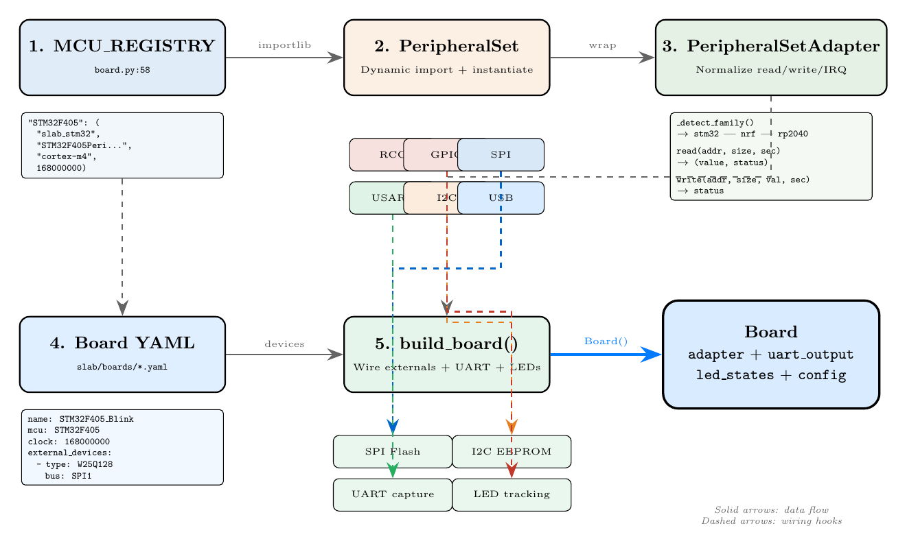

.. _board_e2e_session:

===============================================
Creating a Board and Running an E2E Session
===============================================

This tutorial walks through the complete workflow for creating a custom board
configuration and running an end-to-end (E2E) emulation session in SLAB.
We use the Sentry kernel on STM32U5A5 as the running example throughout.

Author: Mathieu Renard <mathieu.renard@twistedwires.io>

Copyright (C) 2026 Twisted Wires Security Lab

Overview
========

An end-to-end emulation session is the full pipeline from board definition to
firmware analysis:

1. **Board Configuration** -- Declare the MCU, external devices, and memory layout in YAML.
2. **Peripheral Server** -- Instantiate the Python peripheral set and serve it over TCP.
3. **QEMU Launch** -- Start the ``slab-cortex-m`` QEMU machine, pointing it at the server.
4. **Firmware Execution** -- The CPU fetches instructions from flash; every peripheral
   access is proxied to the Python server.
5. **Trace Analysis** -- MMIO traces capture every register read and write for post-mortem
   inspection.
6. **GDB Debugging** -- Attach ``gdb-multiarch`` at any time to set breakpoints, inspect
   stack frames, and step through fault handlers.

   Board assembly pipeline: YAML configuration is parsed, the MCU peripheral set is
   instantiated, external devices are wired, and the board is ready for emulation.

The Board Abstraction
---------------------

In SLAB, a **Board** combines four elements into a single emulation target:

- **MCU Peripheral Set**: The full set of memory-mapped peripherals (RCC, GPIO, USART,
  SPI, I2C, timers, etc.) provided by the SoC emulation library.
- **External Devices**: Virtual components connected to bus peripherals -- SPI flash,
  I2C EEPROM, TFT displays, LEDs, SD cards, and hardware-in-the-loop (HIL) bridges.
- **UART Capture**: All USART/UART transmit callbacks are automatically wired to a
  shared ``board.uart_output`` buffer, capturing every byte the firmware prints.
- **LED Tracking**: GPIO pin-change callbacks update ``board.led_states``, tracking the
  on/off state of each configured LED.

The board is served to QEMU through a ``BasePeripheralServer`` subclass that routes
MMIO reads and writes to the appropriate peripheral implementation. The entire session
runs in a single Python process with ``asyncio``.

Step 1: Identify the MCU
=========================

Every board configuration starts with an MCU name. SLAB maintains a registry of
supported MCUs in ``slab_cortex_m.board.MCU_REGISTRY``. Each entry maps the MCU name
to its Python peripheral set class, default QEMU CPU type, and default clock frequency.

.. code-block:: python

   from slab_cortex_m.board import MCU_REGISTRY

   print(f"Supported MCUs: {len(MCU_REGISTRY)}")
   for mcu, (pkg, cls, cpu, clk) in sorted(MCU_REGISTRY.items()):
       print(f"  {mcu:12s}  {cpu:12s}  {clk // 1_000_000:4d} MHz")

Expected output (truncated):

.. code-block:: text

   Supported MCUs: 20
     IMXRT1060     cortex-m7      600 MHz
     LPC55S69      cortex-m33     150 MHz
     RP2040        cortex-m0      125 MHz
     RP2350        cortex-m33     150 MHz
     STM32F030     cortex-m0       48 MHz
     STM32F103     cortex-m3       72 MHz
     STM32F405     cortex-m4      168 MHz
     STM32F407     cortex-m4      168 MHz
     STM32F411     cortex-m4      100 MHz
     STM32F439     cortex-m4      180 MHz
     STM32H563     cortex-m33     250 MHz
     STM32H745     cortex-m7      480 MHz
     STM32L433     cortex-m4       80 MHz
     STM32U5A5     cortex-m33     160 MHz
     STM32U5A9     cortex-m33     160 MHz
     STM32U585     cortex-m33     160 MHz
     STM32WB35     cortex-m4       64 MHz
     STM32WB55     cortex-m4       64 MHz
     nRF52840      cortex-m4       64 MHz
     nRF5340       cortex-m33     128 MHz

For the Sentry kernel, the MCU is ``STM32U5A5`` (Cortex-M33 at 160 MHz).

SVD Auto-Stub Fallback
----------------------

If your target MCU is not in the registry, SLAB can generate a peripheral set
automatically from an SVD (System View Description) file. Use the ``SVD:`` prefix
in the ``mcu`` field:

.. code-block:: yaml

   name: Custom_MCU_Board
   mcu: "SVD:cmsis-svd/data/STMicro/STM32G474.svd"

The SVD parser extracts peripheral base addresses, register offsets, and reset values,
then generates stub peripherals that respond to reads with reset defaults and accept
all writes. This is a quick way to get firmware past its initialization sequence while
you develop full peripheral models.

.. note::

   SVD auto-stub peripherals do not implement any behavioral logic (clock gating,
   status flag propagation, etc.). They are useful for initial bring-up but will
   need to be replaced with real implementations for anything beyond the boot
   sequence.

Step 2: Write the Board YAML
=============================

Board configurations are stored as YAML files in ``slab/boards/``. Here is the
complete annotated YAML for the Sentry kernel board:

.. code-block:: yaml

   # slab/boards/stm32u5a5_sentry.yaml
   name: STM32U5A5_Sentry
   mcu: STM32U5A5
   clock: 160000000

   external_devices:
     - type: LED
       bus: GPIOC
       params: {pin: 7, color: green}

   # U5A5: 4MB flash, 2496KB SRAM
   # Sentry kernel accesses RCC/PWR at 0x46020xxx and GPIO at 0x42020xxx
   # Cover full peripheral range including AHB2 (0x42000000) and APB3 (0x46000000)
   # STM32U5A5 has 8 MPU regions (QEMU Cortex-M33 defaults to 16)
   qemu_extra:
     sram-size: "0x270000"
     flash-size: "0x400000"
     mpu-regions: "8"

Field-by-field explanation:

``name``
   A human-readable identifier for the board. It appears in log messages and reports.
   Convention: ``MCU_Application`` (e.g., ``STM32U5A5_Sentry``).

``mcu``
   The MCU identifier, which must match a key in ``MCU_REGISTRY`` or use the
   ``SVD:path`` syntax. This determines which Python peripheral set class is
   instantiated and which QEMU CPU type is used by default.

``clock``
   System clock frequency in Hz. Overrides the default from the MCU registry.
   This value is passed to QEMU as ``sysclk-hz`` and controls the SysTick timer
   rate. If omitted or set to ``0``, the registry default is used.

``external_devices``
   A list of virtual components wired to MCU bus peripherals. Each entry has:

   - ``type``: Device type identifier (see list below).
   - ``bus``: Name of the MCU peripheral to connect to (e.g., ``SPI1``, ``I2C1``,
     ``GPIOA``).
   - ``params``: Optional device-specific parameters (pin number, I2C address,
     color, etc.).

``qemu_extra``
   A dictionary of additional QEMU machine properties. All values are strings.
   Common properties:

   - ``flash-base``, ``flash-size``: Override flash memory placement and size.
   - ``sram-base``, ``sram-size``: Override SRAM placement and size.
   - ``mpu-regions``: Number of MPU regions (default: 8 for Cortex-M33).
   - ``bootrom-base``, ``bootrom-size``: Bootrom placement.
   - ``periph-base``, ``periph-size``: Peripheral proxy address range.

Supported External Device Types
--------------------------------

The following device types can appear in the ``external_devices`` list:

.. list-table::
   :widths: 20 20 60
   :header-rows: 1

   * - Type
     - Bus
     - Description
   * - ``LED``
     - ``GPIOx``
     - Status LED. Params: ``pin`` (int), ``color`` (str).
   * - ``W25Q128``
     - ``SPIx``
     - Winbond 128Mbit SPI NOR flash. Also: W25Q16, W25Q32, W25Q64, W25Q256.
   * - ``24C256``
     - ``I2Cx``
     - 256Kbit I2C EEPROM. Also: 24C02 through 24C512. Param: ``address``.
   * - ``ILI9341``
     - ``SPIx``
     - 240x320 TFT LCD display (SPI interface).
   * - ``SSD1306``
     - ``I2Cx``
     - 128x64 OLED display (I2C interface). Param: ``address`` (default 0x3C).
   * - ``SDCARD``
     - ``SDMMCx``
     - Virtual SD card. Params: ``capacity_mb``, ``backing_file``.
   * - ``HIL``
     - any
     - Hardware-in-the-loop bridge. See :ref:`hardware_in_the_loop`.

Step 3: Wire External Devices
==============================

When ``build_board()`` processes the board configuration, it automatically wires
each external device to its bus peripheral using the correct protocol for that
MCU family. Understanding this wiring is important for debugging and for adding
custom devices.

LED on GPIO
-----------

LEDs are the simplest device. No virtual component object is created; instead,
the builder registers a pin-change callback on the GPIO peripheral:

.. code-block:: python

   # After build_board(), LED state is tracked in:
   board.led_states["GPIOC:7"]
   # => {"color": "green", "state": False}

When firmware writes to GPIOC ODR and toggles pin 7, the callback fires and
updates the ``state`` field to ``True`` or ``False``.

SPI Flash (W25QxxFlash)
-----------------------

SPI flash wiring depends on the MCU family:

**STM32 SPI** -- byte-level transfers. Each write to the SPI data register triggers
a single-byte exchange:

.. code-block:: python

   # Wiring: SPI peripheral's on_transfer directly calls flash.transfer_byte
   spi_peripheral.on_transfer = w25q_flash.transfer_byte

**Nordic SPIM** -- DMA packet-level transfers. A complete SPI transaction is handled
in one call:

.. code-block:: python

   def spim_transfer(mosi: bytes) -> bytes:
       device.select()
       result = device.transfer(mosi)
       device.deselect()
       return result

   spim_peripheral.on_transfer = spim_transfer

**Nordic QSPI** -- uses dedicated ``on_flash_access(op, addr, data)`` and
``on_custom_instruction(opcode, data)`` callbacks for direct flash operations.

I2C EEPROM (EEPROM_24Cxx)
--------------------------

**STM32 I2C** -- the ``_I2CDeviceAdapter`` bridges the byte-level I2C state machine
callbacks (``on_start``, ``on_write``, ``on_read``, ``on_stop``) to the EEPROM
packet protocol:

.. code-block:: python

   adapter = _I2CDeviceAdapter(eeprom_device)
   i2c_peripheral.on_start = adapter.on_start
   i2c_peripheral.on_write = adapter.on_write
   i2c_peripheral.on_read  = adapter.on_read
   i2c_peripheral.on_stop  = adapter.on_stop

**Nordic TWIM** -- directly uses the packet-level ``on_transfer(addr, data, is_read)``
callback.

UART Capture
------------

All USART/UART peripherals are automatically wired so that every byte transmitted
by firmware is appended to ``board.uart_output``:

.. code-block:: python

   # After emulation:
   print(board.uart_output.decode('ascii', errors='replace'))

This happens transparently -- no configuration is needed in the board YAML.

Step 4: Build the Board in Python
==================================

With the YAML file in place, load and inspect the board:

.. code-block:: python

   from slab_cortex_m.board import load_board_config, get_qemu_cpu, get_default_clock
   from slab_cortex_m.board_builder import build_board

   config = load_board_config("slab/boards/stm32u5a5_sentry.yaml")
   board = build_board(config)

   print(f"Board: {board.name}")
   print(f"CPU: {get_qemu_cpu(config)} @ {get_default_clock(config) // 1_000_000} MHz")
   print(f"Peripherals: {len(board.adapter.peripherals)}")
   print(f"External devices: {len(board.external_devices)}")
   print(f"LEDs: {board.led_states}")

Expected output:

.. code-block:: text

   Board: STM32U5A5_Sentry
   CPU: cortex-m33 @ 160 MHz
   Peripherals: 56
   External devices: 0
   LEDs: {'GPIOC:7': {'color': 'green', 'state': False}}

.. note::

   LEDs do not create an external device object (the list shows 0 external
   devices), but their state is still tracked in ``board.led_states``. The LED
   entries are handled purely through GPIO pin-change callbacks.

You can directly exercise the peripheral set from Python:

.. code-block:: python

   # Read the RCC CR register (U5 RCC base = 0x46020C00)
   val, status = board.read(0x46020C00, 4, True)
   print(f"RCC CR = 0x{val:08X}")

   # Read PWR VOSR register (U5 PWR base = 0x46020800, VOSR offset = 0x0C)
   val, status = board.read(0x4602080C, 4, True)
   print(f"PWR VOSR = 0x{val:08X}")

Step 5: Create a Server Script
===============================

The server script connects the board to QEMU via the binary peripheral proxy
protocol. Here is a complete, annotated server for the Sentry kernel:

.. code-block:: python
   :caption: sentry_server.py

   #!/usr/bin/env python3
   """Sentry Kernel E2E server."""
   import asyncio
   import sys
   from slab_cortex_m.board import load_board_config, get_qemu_cpu, get_default_clock
   from slab_cortex_m.board_builder import build_board
   from slab_cortex_m.base_server import BasePeripheralServer
   from slab_cortex_m.mmio_tracer import MMIOTracer

   class LiveUartBuffer(bytearray):
       """bytearray subclass that prints each byte to stdout as it arrives."""
       def append(self, byte):
           super().append(byte & 0xFF)
           ch = byte & 0x7F
           if 0x20 <= ch < 0x7F or ch in (0x0A, 0x0D, 0x09):
               sys.stdout.write(chr(ch))
               sys.stdout.flush()

   class SentryBoardServer(BasePeripheralServer):
       """Board-mode server for the Sentry kernel."""
       def __init__(self, board, port):
           super().__init__(port)
           self.board = board
           # Wire IRQ delivery: when a peripheral asserts an IRQ,
           # send_irq() transmits it to QEMU over the TCP link.
           self.board.irq_callback = self.send_irq
           self.mmio_count = 0

       def create_peripherals(self):
           # Board already has peripherals; nothing to create here.
           pass

       def find_peripheral(self, addr):
           # The Board object itself implements read/write/contains,
           # so we return it directly if the address falls in range.
           if self.board.contains(addr):
               self.mmio_count += 1
               return self.board
           return None

The key design point: ``find_peripheral()`` returns the ``Board`` object itself,
which delegates to the correct internal peripheral via ``PeripheralSetAdapter``.
The ``Board.read()`` and ``Board.write()`` methods accept ``(addr, size, secure)``
arguments, matching the protocol expected by ``BasePeripheralServer.handle_client()``.

.. warning::

   A common mistake is returning a raw peripheral from ``find_peripheral()`` instead
   of the board proxy. This breaks because raw peripherals may use a 2-argument
   ``read(addr, size)`` signature, while the base server protocol always calls
   ``read(addr, size, secure)`` with three arguments.

Step 6: Launch QEMU
=====================

Build the QEMU machine options string from the board configuration, then launch
QEMU with the combined firmware binary.

Building the Machine Options
----------------------------

The machine options string combines the CPU type, TCP port, clock frequency, and
any ``qemu_extra`` properties:

.. code-block:: python

   cpu = get_qemu_cpu(config)       # "cortex-m33"
   clock = get_default_clock(config) # 160000000

   machine_opts = f'slab-cortex-m,cpu-type={cpu},tcp-port={port}'
   if clock:
       machine_opts += f',sysclk-hz={clock}'
   for key, val in config.qemu_extra.items():
       machine_opts += f',{key}={val}'

For the Sentry board, this produces:

.. code-block:: text

   slab-cortex-m,cpu-type=cortex-m33,tcp-port=5555,sysclk-hz=160000000,sram-size=0x270000,flash-size=0x400000,mpu-regions=8

Full QEMU Command
------------------

.. code-block:: bash

   build/qemu-system-arm \
     -M slab-cortex-m,cpu-type=cortex-m33,tcp-port=5555,sysclk-hz=160000000,sram-size=0x270000,flash-size=0x400000,mpu-regions=8 \
     -kernel /tmp/sentry-combined.bin \
     -nographic -monitor none \
     -gdb tcp::1234

The flags:

- ``-M slab-cortex-m,...``: The SLAB custom machine with all properties.
- ``-kernel``: Path to the flat binary firmware image.
- ``-nographic -monitor none``: Disable graphical output and the QEMU monitor.
- ``-gdb tcp::1234``: Open a GDB server on port 1234 for debugging.

.. note::

   SLAB uses ``-M slab-cortex-m,prop=val`` syntax for machine properties.
   The CPU type is set via the ``cpu-type`` machine property, not the QEMU
   ``-cpu`` flag. The ``-global`` flag is also not used.

Step 7: Intel HEX Firmware Merging
====================================

Real-world firmware is often split across multiple binaries. The Sentry kernel
produces three separate Intel HEX files:

- ``sentry-kernel.hex`` -- the kernel itself
- ``idle.hex`` -- the idle task
- ``autotest.hex`` -- the autotest user task (optional)

Each HEX file contains code and data at specific flash addresses. We need to
merge them into a single flat binary for QEMU's ``-kernel`` flag.

Intel HEX Format
-----------------

An Intel HEX file is a text format where each line (record) looks like:

.. code-block:: text

   :LLAAAATT[DD...]CC

- ``LL``: Byte count of the data field.
- ``AAAA``: 16-bit address (combined with the base address from type 04 records).
- ``TT``: Record type -- ``00`` = data, ``04`` = extended linear address, ``01`` = EOF.
- ``DD``: Data bytes.
- ``CC``: Checksum.

Parsing Intel HEX
------------------

.. code-block:: python

   def parse_ihex(path: Path) -> list[tuple[int, bytes]]:
       """Parse Intel HEX file into a list of (address, data) segments."""
       segments = []
       base_addr = 0
       cur_addr = None
       cur_data = bytearray()

       for line in path.read_text().splitlines():
           line = line.strip()
           if not line.startswith(':'):
               continue
           raw = bytes.fromhex(line[1:])
           byte_count = raw[0]
           addr16 = (raw[1] << 8) | raw[2]
           rec_type = raw[3]
           data = raw[4:4 + byte_count]

           if rec_type == 0x00:  # Data record
               abs_addr = base_addr + addr16
               if cur_addr is not None and abs_addr == cur_addr + len(cur_data):
                   cur_data.extend(data)  # Contiguous: append
               else:
                   if cur_data:
                       segments.append((cur_addr, bytes(cur_data)))
                   cur_addr = abs_addr
                   cur_data = bytearray(data)
           elif rec_type == 0x04:  # Extended linear address
               base_addr = ((data[0] << 8) | data[1]) << 16
           elif rec_type == 0x01:  # End of file
               break

       if cur_data:
           segments.append((cur_addr, bytes(cur_data)))
       return segments

Merging Multiple HEX Files
---------------------------

The merge function collects segments from all HEX files, filters to the flash
region (skipping SRAM-resident sections like ``.svcexchange``), and fills gaps
with ``0xFF`` (erased flash):

.. code-block:: python

   def merge_hex_files(hex_files: list[Path],
                       flash_base: int = 0x08000000,
                       flash_size: int = 0x400000) -> bytes:
       """Merge multiple Intel HEX files into a flat binary for QEMU."""
       flash_end = flash_base + flash_size
       all_segments = []

       for hf in hex_files:
           if not hf.exists():
               continue
           for addr, data in parse_ihex(hf):
               if addr >= flash_base and addr + len(data) <= flash_end:
                   all_segments.append((addr, data))
               # Segments outside flash range (e.g. SRAM) are silently skipped

       if not all_segments:
           raise FileNotFoundError("No valid HEX data in flash range")

       max_end = max(a + len(d) for a, d in all_segments)
       size = max_end - flash_base
       image = bytearray(b'\xff' * size)

       for addr, seg_data in all_segments:
           offset = addr - flash_base
           image[offset:offset + len(seg_data)] = seg_data

       return bytes(image)

Usage for the Sentry kernel:

.. code-block:: python

   from pathlib import Path

   hex_files = [
       Path("builddir/kernel/sentry-kernel.hex"),
       Path("builddir/idle/idle.hex"),
       Path("builddir/autotest/autotest.hex"),
   ]
   fw_data = merge_hex_files(hex_files)

   fw_path = Path("/tmp/sentry-combined.bin")
   fw_path.write_bytes(fw_data)
   print(f"Combined firmware: {len(fw_data)} bytes ({len(fw_data):#x})")

.. warning::

   The ``parse_ihex()`` / ``merge_hex_files()`` approach is self-contained and
   does not require ``arm-none-eabi-objcopy`` or any external toolchain. This is
   intentional: it allows E2E scripts to run in CI environments without a full
   cross-compilation setup.

Step 8: MMIO Tracing and Analysis
==================================

Attach an ``MMIOTracer`` to the server to capture every peripheral register access
during firmware execution.

Attaching the Tracer
--------------------

.. code-block:: python

   from slab_cortex_m.mmio_tracer import MMIOTracer

   tracer = MMIOTracer()
   server.tracer = tracer

The tracer integrates with ``BasePeripheralServer.handle_client()`` -- every read
and write through the TCP protocol triggers ``trace_read()`` or ``trace_write()``
automatically.

Exporting Traces
----------------

After the emulation run completes, export to the format you need:

.. code-block:: python

   # Human-readable text format
   tracer.export_text("sentry_mmio.txt")

   # Machine-readable JSON Lines
   tracer.export_json("sentry_mmio.jsonl")

   # Spreadsheet CSV
   tracer.export_csv("sentry_mmio.csv")

Expected Sentry Kernel Output
-----------------------------

A typical Sentry kernel boot produces a trace summary like:

.. code-block:: text

   Top peripherals accessed:
     USART1                     2374 ops  (top: ISR)
     RCC                          65 ops  (top: AHB2ENR1)
     GPIOA                        27 ops  (top: MODER)
     RNG                          11 ops  (top: SR)
     PWR                           9 ops  (top: VOSR)
     GPIOC                         8 ops  (top: ODR)
     ICACHE                        4 ops  (top: CR)
     FLASH                         3 ops  (top: NSSR)

The high USART1 access count comes from the kernel's serial console output. RCC
accesses reflect clock tree initialization (enabling AHB2 for GPIO, APB3 for PWR,
etc.). PWR VOSR reads indicate the firmware polling for voltage scaling readiness.

Generating the Summary
----------------------

.. code-block:: python

   if tracer.traces:
       psummary = tracer.get_peripheral_summary()
       ranked = sorted(
           psummary.items(),
           key=lambda x: x[1].get('reads', 0) + x[1].get('writes', 0),
           reverse=True,
       )
       for name, info in ranked[:10]:
           total = info.get('reads', 0) + info.get('writes', 0)
           top_reg = info.get('top_reg', '?')
           print(f"  {name:24s} {total:6d} ops  (top: {top_reg})")

See :ref:`mmio_tracing` for the full tracing API, including spin loop detection,
init sequence extraction, and CI regression workflows.

Step 9: Debug with GDB
========================

The ``-gdb tcp::1234`` flag on the QEMU command line opens a GDB server that you
can connect to at any time during or after execution.

Connecting GDB
--------------

.. code-block:: bash

   gdb-multiarch -batch \
     -ex "target remote localhost:1234" \
     -ex "file sentry-kernel.elf" \
     -ex "add-symbol-file idle.elf" \
     -ex "break hardfault_handler" \
     -ex "break usagefault_handler" \
     -ex "continue" \
     -ex "bt 10" \
     -ex "info registers"

This script:

1. Connects to the QEMU GDB server.
2. Loads symbols from the kernel ELF.
3. Adds symbols from the idle task ELF.
4. Sets breakpoints on fault handlers.
5. Continues execution until a fault or breakpoint is hit.
6. Prints the backtrace and register state.

Reading the Stacked Exception Frame
------------------------------------

When a Cortex-M takes an exception, the hardware pushes eight words onto the
active stack pointer (PSP for thread mode, MSP for handler mode). To inspect
the frame at the Process Stack Pointer:

.. code-block:: bash

   (gdb) x/8xw $psp

This gives:

.. code-block:: text

   0x20001000:  0x00000000  0x20004000  0x00000002  0x00000000
   0x20001010:  0x00000000  0x0800abcd  0x0800efgh  0x21000000

The layout is: ``R0, R1, R2, R3, R12, LR, PC, xPSR``.

- **PC** (offset +24): The instruction address that caused the fault.
- **LR** (offset +20): The return address before the fault.
- **xPSR** (offset +28): Includes the IPSR field (exception number) in bits [8:0].

Interactive Debugging
---------------------

For interactive sessions (not batch mode), connect and explore:

.. code-block:: bash

   gdb-multiarch
   (gdb) target remote localhost:1234
   (gdb) file sentry-kernel.elf
   (gdb) break main
   (gdb) continue
   (gdb) info threads
   (gdb) print/x *((volatile uint32_t*)0x46020C00)  # RCC CR
   (gdb) x/16xw 0x46020C00                           # RCC register dump
   (gdb) step
   (gdb) next

.. note::

   The GDB port can be changed by modifying the ``-gdb tcp::PORT`` argument on
   the QEMU command line. The default in the Sentry E2E runner is port 1234.

Step 10: Stubbing Missing Peripherals
=======================================

When firmware accesses a peripheral that is not implemented, the server logs an
"Unmapped read/write" message and the tracer records the access with no peripheral
name. The firmware typically receives ``0x00000000`` for reads on unmapped addresses.

Identifying Missing Peripherals
--------------------------------

After a run, check the tracer for unmapped accesses:

.. code-block:: python

   unmapped = [t for t in tracer.traces if t.peripheral_name is None]
   if unmapped:
       # Group by address to find patterns
       from collections import Counter
       addr_counts = Counter(t.address for t in unmapped)
       for addr, count in addr_counts.most_common(10):
           print(f"  0x{addr:08X}: {count} accesses")

Example output:

.. code-block:: text

   0x420A0000: 42 accesses
   0x420A0004: 12 accesses

If you see repeated accesses to an address range, look up the peripheral in the
MCU reference manual. For STM32U5, ``0x420A0000`` falls in the AHB2 peripheral
region -- this could be a USB OTG controller or another AHB2 peripheral.

Adding a Quick Stub
--------------------

Create a minimal stub by subclassing and adding it to the peripheral set:

.. code-block:: python

   from slab_stm32.stm32_base import STM32Peripheral

   class STM32U5_OTGFS_Stub(STM32Peripheral):
       """Minimal USB OTG FS stub for STM32U5."""
       def __init__(self):
           super().__init__(base=0x420A0000, size=0x400, name="OTG_FS")
           # GOTGCTL: return BSVLD to indicate USB cable connected
           self.regs[0x00] = 0x00040000

       def read(self, address, size, secure=True):
           offset = address - self.base
           return (self.regs.get(offset, 0), 0)

       def write(self, address, size, value, secure=True):
           offset = address - self.base
           self.regs[offset] = value
           return 0

Then register it in your peripheral set before building the board:

.. code-block:: python

   pset = create_peripheral_set(config)
   stub = STM32U5_OTGFS_Stub()
   pset.peripherals.append(stub)
   # ... continue with PeripheralSetAdapter wrapping ...

ARMv7-M vs ARMv8-M Considerations
===================================

The Sentry kernel runs on a Cortex-M33 (ARMv8-M Mainline), which differs from
older Cortex-M4 (ARMv7-M) in several ways that affect emulation.

Bitband
-------

ARMv7-M (Cortex-M3/M4/M7) provides a **bitband** alias at ``0x42000000`` --
``0x43FFFFFF`` that maps individual bits in the peripheral region
``0x40000000`` -- ``0x400FFFFF``.

ARMv8-M (Cortex-M23/M33/M55/M85) **removes bitband entirely**. The address range
``0x42000000`` -- ``0x43FFFFFF`` is instead used for AHB2 peripherals. On the
STM32U5, GPIO ports (GPIOA at ``0x42020000``) and USB OTG live in this region.

.. warning::

   If QEMU's ``enable-bitband`` property is ``true`` on an ARMv8-M target, reads
   from ``0x42040000`` (e.g., USB OTG HS) will be silently reinterpreted as
   bitband accesses to ``0x40002000``, producing garbage values. SLAB automatically
   disables bitband for ARMv8-M CPUs.

TrustZone
----------

Cortex-M33 supports TrustZone (``ARM_FEATURE_M_SECURITY``), which splits the
processor state into Secure and Non-Secure worlds. When TrustZone is enabled:

- The peripheral proxy protocol uses ``S`` (Secure Read) and ``T`` (Secure Write)
  command bytes in addition to ``R`` and ``W``.
- PSP is banked into PSP_S and PSP_NS.
- EXC_RETURN encodings differ between Secure and Non-Secure.

For firmware that does not use TrustZone separation (like the Sentry autotest
mode), you can let QEMU strip ``ARM_FEATURE_M_SECURITY`` by not adding
``trustzone=on`` to the machine options. This avoids PSP banking complexity and
lets standard ARMv8-M ``EXC_RETURN`` values work without Secure/Non-Secure
distinction.

MPU Regions
-----------

The number of MPU regions varies by MCU:

- Cortex-M3/M4/M7 (PMSAv7): typically 8 regions.
- Cortex-M33 (PMSAv8): typically 8 regions, but QEMU defaults to 16.

The Sentry kernel configures exactly 8 PMSAv8 MPU regions, so the board YAML
includes ``mpu-regions: "8"`` to match the hardware.

.. code-block:: yaml

   qemu_extra:
     mpu-regions: "8"

.. note::

   PMSAv7 and PMSAv8 use different register layouts internally. PMSAv7 uses
   ``DRBAR``/``DRSR``/``DRACR`` arrays, while PMSAv8 uses ``RBAR``/``RLAR``
   register banks. The QEMU ``mpu-regions`` property controls the array sizes
   for both architectures.

Putting It All Together
========================

Here is the complete E2E runner script, based on the actual
``slab/tests/run_sentry_e2e.py``:

.. code-block:: python
   :caption: run_sentry_e2e.py (simplified)

   #!/usr/bin/env python3
   """Sentry Kernel U5A5 E2E runner."""
   import asyncio
   import socket
   import sys
   import time
   from pathlib import Path

   sys.path.insert(0, "slab/python")

   from slab_cortex_m.board import load_board_config, get_qemu_cpu, get_default_clock
   from slab_cortex_m.board_builder import build_board
   from slab_cortex_m.base_server import BasePeripheralServer
   from slab_cortex_m.mmio_tracer import MMIOTracer

   QEMU_BIN = "build/qemu-system-arm"
   BOARD_YAML = "slab/boards/stm32u5a5_sentry.yaml"
   TIMEOUT = 30
   GDB_PORT = 1234

   # -- Intel HEX merging (parse_ihex / merge_hex_files as above) --

   class LiveUartBuffer(bytearray):
       def append(self, byte):
           super().append(byte & 0xFF)
           ch = byte & 0x7F
           if 0x20 <= ch < 0x7F or ch in (0x0A, 0x0D, 0x09):
               sys.stdout.write(chr(ch))
               sys.stdout.flush()

   class SentryBoardServer(BasePeripheralServer):
       def __init__(self, board, port):
           super().__init__(port)
           self.board = board
           self.board.irq_callback = self.send_irq
           self.mmio_count = 0

       def create_peripherals(self):
           pass

       def find_peripheral(self, addr):
           if self.board.contains(addr):
               self.mmio_count += 1
               return self.board
           return None

   async def main():
       # 1. Merge firmware from HEX files
       hex_files = [Path("kernel.hex"), Path("idle.hex"), Path("autotest.hex")]
       fw_data = merge_hex_files(hex_files)
       fw_path = Path("/tmp/sentry-combined.bin")
       fw_path.write_bytes(fw_data)

       # 2. Build board
       config = load_board_config(BOARD_YAML)
       board = build_board(config)

       # 3. Replace UART buffer with live version
       board.uart_output = LiveUartBuffer()
       for p in board.adapter.peripherals:
           name = getattr(p, 'name', '')
           if ('USART' in name or 'UART' in name) and hasattr(p, 'on_tx'):
               def make_handler(buf=board.uart_output):
                   def handler(byte):
                       buf.append(byte & 0xFF)
                   return handler
               p.on_tx = make_handler()

       # 4. Create server + tracer
       port = find_free_port()
       server = SentryBoardServer(board, port)
       server.running = True
       tracer = MMIOTracer()
       server.tracer = tracer

       tcp_server = await asyncio.start_server(
           server.handle_client, '127.0.0.1', port, reuse_address=True)

       # 5. Build QEMU command
       cpu = get_qemu_cpu(config)
       clock = get_default_clock(config)
       machine_opts = f'slab-cortex-m,cpu-type={cpu},tcp-port={port}'
       if clock:
           machine_opts += f',sysclk-hz={clock}'
       for key, val in config.qemu_extra.items():
           machine_opts += f',{key}={val}'

       qemu_cmd = [
           QEMU_BIN, '-M', machine_opts,
           '-kernel', str(fw_path),
           '-nographic', '-monitor', 'none',
           '-gdb', f'tcp::{GDB_PORT}',
       ]

       # 6. Launch QEMU and wait
       start = time.time()
       qemu = await asyncio.create_subprocess_exec(
           *qemu_cmd,
           stdout=asyncio.subprocess.PIPE,
           stderr=asyncio.subprocess.PIPE,
       )

       try:
           await asyncio.wait_for(qemu.communicate(), timeout=TIMEOUT)
       except asyncio.TimeoutError:
           qemu.terminate()
           await qemu.wait()

       elapsed = time.time() - start

       # 7. Cleanup
       server.running = False
       tcp_server.close()
       await tcp_server.wait_closed()

       # 8. Report results
       tracer.export_text("sentry_mmio.txt")
       tracer.export_json("sentry_mmio.jsonl")

       print(f"Duration: {elapsed:.1f}s")
       print(f"MMIO ops: {server.mmio_count}")
       print(f"UART: {board.uart_output.decode('ascii', errors='replace')[:200]}")

   def find_free_port():
       with socket.socket(socket.AF_INET, socket.SOCK_STREAM) as s:
           s.bind(('127.0.0.1', 0))
           return s.getsockname()[1]

   if __name__ == '__main__':
       asyncio.run(main())

Running the Script
------------------

.. code-block:: bash

   # Build QEMU first (one-time)
   mkdir -p build && cd build && ../configure --target-list=arm-softmmu && ninja

   # Set the path to Sentry build output
   export SENTRY_BUILD=/path/to/sentry-kernel/builddir

   # Run the E2E session
   PYTHONPATH=slab/python python3 slab/tests/run_sentry_e2e.py

Expected output:

.. code-block:: text

   ========================================================================
     Sentry Kernel E2E -- STM32U5A5
     HEX files: sentry-kernel.hex, idle.hex, autotest.hex
     Combined : /tmp/sentry-combined.bin (1048576 bytes)
     Board    : stm32u5a5_sentry.yaml
     CPU      : cortex-m33 @ 160 MHz
     Periphs  : 64
     TCP port : 39421
     GDB      : localhost:1234 (attach anytime)
     Timeout  : 30s
   ========================================================================

   [Sentry kernel UART output appears here in real-time]

   ========================================================================
     Results
   ========================================================================
     Duration   : 30.0s
     MMIO ops   : 2519
     QEMU exit  : 124
     Trace len  : 2519 entries

     Top peripherals accessed:
       USART1                     2374 ops  (top: ISR)
       RCC                          65 ops  (top: AHB2ENR1)
       GPIOA                        27 ops  (top: MODER)
       RNG                          11 ops  (top: SR)
       PWR                           9 ops  (top: VOSR)

   ========================================================================
     PASS -- 2519 MMIO transactions
   ========================================================================

Troubleshooting
================

QEMU exits immediately with no output
--------------------------------------

Check that the firmware binary contains a valid vector table. The first word at
address 0 (or ``flash-base``) must be the initial Stack Pointer, and the second
word must be the Reset Handler address (with bit 0 set for Thumb mode). Verify
with:

.. code-block:: bash

   hexdump -C /tmp/sentry-combined.bin | head -1
   # Expected: first 4 bytes = SP (e.g. 20 00 02 70), next 4 = Reset_Handler

Firmware loops on RCC or PWR register
--------------------------------------

The MMIO tracer will show a spin loop:

.. code-block:: text

   Spin: RCC->CR x200 (seq 3-203)

This means the firmware is polling a ready bit that never gets set. Check that
the peripheral model for your MCU family auto-sets ready flags. For STM32U5, the
RCC model should set ``MSISRDY`` when ``MSISON`` is written, ``HSIRDY`` when
``HSION`` is written, etc.

See :ref:`debugging_bootloops` for more spin loop debugging techniques.

"Unknown MCU" error
--------------------

If ``load_board_config()`` raises ``ValueError: Unknown MCU``, either:

1. Add the MCU to ``MCU_REGISTRY`` with the correct peripheral set, or
2. Use the SVD auto-stub fallback: ``mcu: "SVD:path/to/device.svd"``

Next Steps
==========

- :ref:`creating_boards` -- Detailed reference for all board YAML fields and
  supported device types.
- :ref:`mmio_tracing` -- Full MMIO tracer API: spin loops, init sequences, CI
  regression workflows.
- :ref:`stubbing_peripherals` -- Create custom peripheral implementations for
  unsupported hardware blocks.
- :ref:`trustzone_emulation` -- Configure TrustZone-enabled boards with
  Secure/Non-Secure partitioning.
- :ref:`debugging_bootloops` -- Systematic approach to diagnosing firmware
  initialization failures.

---

**Author**: Mathieu Renard <mathieu.renard@twistedwires.io>

**Copyright**: (C) 2026 Twisted Wires Security Lab
