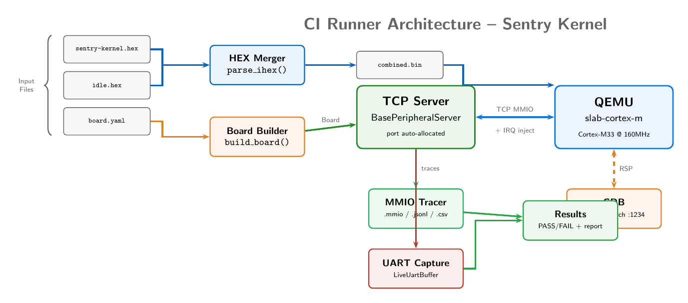

.. _sentry_ci_runner:

==============================================
Building a CI Runner: Sentry Kernel Example
==============================================

This tutorial walks through building a complete CI runner for the Ledger Sentry
kernel, a secure microkernel targeting the STM32U5A5 (Cortex-M33). You will learn
how to merge multi-binary firmware from Intel HEX files, configure a board for a
real-world secure OS, wire live UART output, attach MMIO tracing, handle QEMU
process management with asyncio, and integrate GDB debugging -- all within a single
self-contained Python script.

**Author:** Mathieu Renard <mathieu.renard@twistedwires.io>

**Copyright:** (C) 2026 Twisted Wires Security Lab

**Prerequisites:**

- Completed :ref:`ci_testing` (CI assertion framework)
- Completed :ref:`creating_boards` (board YAML and wiring)
- Completed :ref:`mmio_tracing` (MMIO trace analysis)
- QEMU built with ``slab-cortex-m`` machine support
- Sentry kernel build tree (kernel + idle task Intel HEX files)

Overview
========

The Sentry kernel is a minimal, security-oriented microkernel developed by Ledger
for their hardware security products. It runs on STM32U5A5 (Cortex-M33 at 160 MHz)
and follows a strict multi-binary architecture:

- **Kernel**: privileged code at ``0x08000000`` (~37 KB)
- **Idle task**: unprivileged user task at ``0x0800C000`` (~1 KB)
- **Optional user tasks**: additional ELF/HEX binaries at higher flash addresses

Unlike monolithic firmware that ships as a single ``.bin`` file, Sentry produces
separate Intel HEX files for each component. The CI runner must merge these into
a single flat binary before loading into QEMU.

This tutorial builds the complete runner script step by step, resulting in a file
equivalent to ``slab/tests/run_sentry_e2e.py``.

Step 1: Understand the Sentry Firmware Architecture
====================================================

Before writing any code, it is essential to understand what the firmware does at
boot and what output to expect.

Boot Sequence
-------------

1. **Vector table** at ``0x08000000``: initial stack pointer and ``Reset_Handler``
2. Kernel initializes clocks (MSI at 4 MHz), GPIO, USART1, RNG, and MPU
3. Kernel prints ``"Starting Sentry kernel release v0.1"`` on USART1
4. Kernel reads the ``.task_list`` section at ``0x08000258`` to discover user tasks
5. Each task descriptor contains a magic value, entry point, stack pointer, and flags
6. Kernel switches to unprivileged mode and jumps to the idle task entry point
7. Idle task prints ``"hello this is idle!"`` via ``__sys_log`` SVC call
8. Idle task enters an infinite loop calling ``__sys_sched_yield`` and printing
   ``"yielding for scheduler..."``

Task List Section
-----------------

The ``.task_list`` section is a fixed-location array of task descriptors that the
kernel scans at boot:

.. code-block:: text

   Offset  Field           Size   Description
   0x00    magic           4B     0xDEADCAFE (valid task marker)
   0x04    entry_point     4B     Task entry address (thumb bit set)
   0x08    stack_base      4B     Task stack base address in SRAM
   0x0C    stack_size      4B     Task stack size in bytes
   0x10    priority        4B     Scheduling priority
   0x14    flags           4B     Privilege level, TrustZone attributes

The kernel iterates over entries until it finds one without the magic value.

Expected UART Output
--------------------

A successful boot produces the following on USART1 (115200 baud):

.. code-block:: text

   Starting Sentry kernel release v0.1
   hello this is idle!
   yielding for scheduler...
   yielding for scheduler...
   yielding for scheduler...

The CI runner validates that this output appears within the timeout window.

Step 2: Intel HEX Firmware Merging
====================================

Sentry produces separate Intel HEX (``.hex``) files for the kernel and each user
task. QEMU expects a single flat binary. This step implements a pure-Python Intel
HEX parser and merger with no external tool dependencies (no ``arm-none-eabi-objcopy``,
no ``srec_cat``).

Intel HEX Record Format
------------------------

Each line in an Intel HEX file follows this structure:

.. code-block:: text

   :LLAAAARR[DD...]CC

   LL   - Byte count (number of data bytes)
   AAAA - 16-bit address offset
   RR   - Record type:
            0x00 = Data record
            0x01 = End of File
            0x04 = Extended Linear Address (sets upper 16 bits)
   DD   - Data bytes (LL bytes)
   CC   - Two's complement checksum

Record type ``0x04`` sets the base address for subsequent data records. For example,
``:02000004 0800 F2`` sets the base to ``0x08000000``. Data records then provide
16-bit offsets within that base.

Parsing Intel HEX
------------------

The parser reads each line, tracks the current base address, and coalesces
contiguous data records into segments:

.. code-block:: python

   from pathlib import Path

   def parse_ihex(path: Path) -> list[tuple[int, bytes]]:
       """Parse Intel HEX file into (address, data) segments.

       Intel HEX record format: :LLAAAARR[DD...]CC
       - LL: byte count
       - AAAA: 16-bit address
       - RR: record type (0x00=data, 0x01=EOF, 0x04=extended linear address)
       - DD: data bytes
       - CC: checksum
       """
       segments = []
       base_addr = 0
       cur_addr = None
       cur_data = bytearray()

       for line in path.read_text().splitlines():
           line = line.strip()
           if not line.startswith(':'):
               continue
           raw = bytes.fromhex(line[1:])
           byte_count = raw[0]
           addr16 = (raw[1] << 8) | raw[2]
           rec_type = raw[3]
           data = raw[4:4 + byte_count]

           if rec_type == 0x00:  # Data record
               abs_addr = base_addr + addr16
               if cur_addr is not None and abs_addr == cur_addr + len(cur_data):
                   cur_data.extend(data)
               else:
                   if cur_data:
                       segments.append((cur_addr, bytes(cur_data)))
                   cur_addr = abs_addr
                   cur_data = bytearray(data)
           elif rec_type == 0x04:  # Extended Linear Address
               base_addr = ((data[0] << 8) | data[1]) << 16
           elif rec_type == 0x01:  # EOF
               break

       if cur_data:
           segments.append((cur_addr, bytes(cur_data)))
       return segments

.. note::

   The parser coalesces contiguous data records into single segments. This is
   important because Intel HEX files commonly split data into 16-byte or 32-byte
   records, and producing one segment per record would waste memory and complicate
   merging.

Merging Multiple HEX Files
---------------------------

The merger collects segments from all HEX files, filters to the flash address
range, and produces a flat binary with gaps filled by ``0xFF`` (erased flash):

.. code-block:: python

   def merge_hex_files(hex_files: list[Path], flash_base: int = 0x08000000,
                       flash_size: int = 0x400000) -> bytes:
       """Merge HEX files into flat binary, filtering to flash region only.

       Segments outside the flash region (e.g., SRAM-resident sections like
       .svcexchange) are silently skipped. Gaps between segments are filled
       with 0xFF to match erased NOR flash.
       """
       flash_end = flash_base + flash_size
       all_segments = []

       for hf in hex_files:
           if not hf.exists():
               continue
           for addr, data in parse_ihex(hf):
               if addr >= flash_base and addr + len(data) <= flash_end:
                   all_segments.append((addr, data))

       if not all_segments:
           raise FileNotFoundError("No valid HEX data in flash range")

       max_end = max(a + len(d) for a, d in all_segments)
       result = bytearray(b'\xff' * (max_end - flash_base))
       for addr, seg in all_segments:
           offset = addr - flash_base
           result[offset:offset + len(seg)] = seg

       return bytes(result)

.. warning::

   Sentry's idle task places a small ``.svcexchange`` section in SRAM
   (``0x20000000`` range). The ``merge_hex_files`` function must skip these
   non-flash segments. The address filter ``addr >= flash_base`` handles this
   automatically.

For the Sentry kernel with kernel + idle task, the merged binary is approximately
50 KB:

.. code-block:: text

   sentry-kernel.hex: 37852 bytes at 0x08000000
   idle.hex:          1204 bytes at 0x0800C000
   Combined:          50108 bytes (0xC3BC)

Step 3: Board Configuration
=============================

The Sentry kernel targets the STM32U5A5, which has specific memory and peripheral
requirements that differ from the default QEMU Cortex-M33 configuration.

Board YAML
-----------

Create ``slab/boards/stm32u5a5_sentry.yaml``:

.. code-block:: yaml

   name: STM32U5A5_Sentry
   mcu: STM32U5A5
   clock: 160000000

   external_devices:
     - type: LED
       bus: GPIOC
       params: {pin: 7, color: green}

   # U5A5: 4MB flash, 2496KB SRAM
   # Sentry kernel accesses RCC/PWR at 0x46020xxx and GPIO at 0x42020xxx
   # Cover full peripheral range including AHB2 (0x42000000) and APB3 (0x46000000)
   # STM32U5A5 has 8 MPU regions (QEMU Cortex-M33 defaults to 16)
   qemu_extra:
     sram-size: "0x270000"
     flash-size: "0x400000"
     mpu-regions: "8"

Configuration Details
---------------------

**Flash size (4 MB)**:
The STM32U5A5 has 4 MB of internal flash. The default QEMU flash size of 1 MB is
insufficient for Sentry's multi-binary layout where the idle task sits at offset
``0xC000``.

**SRAM size (2496 KB = 0x270000)**:
The U5A5 has multiple SRAM banks (SRAM1, SRAM2, SRAM3, SRAM5) that are contiguous
in the memory map starting at ``0x20000000``. The total is 2496 KB. SLAB maps this
as a single flat SRAM region for simplicity.

**MPU regions (8)**:
The real STM32U5A5 has 8 PMSAv8 MPU regions. QEMU's Cortex-M33 defaults to 16
regions. Sentry's MPU configuration assumes exactly 8 regions and will fault if
the region count does not match. The ``mpu-regions`` property overrides the default.

**Clock (160 MHz)**:
The ``sysclk-hz`` QEMU property prevents SysTick interrupt storms. Without it,
QEMU assumes 168 MHz and the SysTick period calculation drifts, causing excessive
timer interrupts that slow emulation.

**Peripheral address ranges**:
The STM32U5A5 places peripherals across two major regions:

- AHB2: ``0x42000000`` (GPIO, USB OTG HS)
- APB3: ``0x46000000`` (RCC, PWR)

.. note::

   The STM32U5A5 is an ARMv8-M device (Cortex-M33). Unlike ARMv7-M devices
   (Cortex-M3/M4/M7), it does **not** have bitband aliasing. The ``0x42000000``
   region is used for AHB2 peripherals (GPIO, USB), not for bitband access.
   SLAB automatically disables ``enable-bitband`` for ARMv8-M CPUs.

Step 4: Server Architecture
=============================

The CI runner needs a peripheral server that bridges QEMU MMIO requests to the
board's peripheral emulation. This section builds two key classes: the server and
a live UART buffer.

LiveUartBuffer
--------------

Standard board UART capture stores bytes silently. For interactive debugging and
CI log visibility, a live buffer prints each character to stdout as it arrives:

.. code-block:: python

   import sys

   class LiveUartBuffer(bytearray):
       """bytearray that prints each byte to stdout as it arrives."""

       def append(self, byte):
           super().append(byte & 0xFF)
           ch = byte & 0x7F
           if 0x20 <= ch < 0x7F or ch in (0x0A, 0x0D, 0x09):
               sys.stdout.write(chr(ch))
               sys.stdout.flush()

The ``& 0x7F`` mask strips the high bit (some firmware sends raw 8-bit values).
Only printable ASCII, newlines, carriage returns, and tabs are forwarded to the
terminal. Binary data is silently absorbed into the buffer without corrupting
terminal output.

SentryBoardServer
-----------------

The server subclasses ``BasePeripheralServer`` and delegates all MMIO lookups to
the board object:

.. code-block:: python

   from slab_cortex_m.base_server import BasePeripheralServer

   class SentryBoardServer(BasePeripheralServer):
       """Peripheral server for Sentry kernel CI testing."""

       def __init__(self, board, port):
           super().__init__(port)
           self.board = board
           self.board.irq_callback = self.send_irq
           self.mmio_count = 0

       def create_peripherals(self):
           """No-op: peripherals are owned by the board, not the server."""
           pass

       def find_peripheral(self, addr):
           """Route MMIO access to the board if it contains the address."""
           if self.board.contains(addr):
               self.mmio_count += 1
               return self.board
           return None

Key design points:

- ``create_peripherals()`` is a no-op because the board builder already created
  all peripherals during ``build_board()``.
- ``find_peripheral()`` returns the board proxy object (not a raw peripheral).
  This is critical: the board proxy implements the ``read(addr, size, secure)``
  three-argument interface that ``BasePeripheralServer`` expects.
- ``self.board.irq_callback = self.send_irq`` wires interrupt assertions from
  any peripheral back to QEMU via the TCP protocol.
- ``self.mmio_count`` provides a simple activity metric for pass/fail decisions.

UART Re-wiring
--------------

After building the board, replace the default ``uart_output`` buffer with the
live variant and re-wire all UART peripheral TX callbacks:

.. code-block:: python

   from slab_cortex_m.board import load_board_config
   from slab_cortex_m.board_builder import build_board

   config = load_board_config(str(BOARD_YAML))
   board = build_board(config)

   # Replace with live buffer
   board.uart_output = LiveUartBuffer()

   # Re-wire UART TX callbacks to write to the live buffer
   for p in board.adapter.peripherals:
       name = getattr(p, 'name', '')
       if ('USART' in name or 'UART' in name) and hasattr(p, 'on_tx'):
           def make_handler(buf=board.uart_output):
               def handler(byte):
                   buf.append(byte & 0xFF)
               return handler
           p.on_tx = make_handler()

.. warning::

   The closure ``make_handler`` captures ``buf`` as a default argument to avoid
   the classic Python closure-in-a-loop bug. Without this pattern, all UART
   peripherals would share a reference to the last value of ``buf``, which may
   not be the live buffer.

Step 5: QEMU Launch Configuration
===================================

Assembling the correct QEMU command line requires combining the CPU type, clock
frequency, TCP port, and board-specific overrides from ``qemu_extra``.

Machine Options Assembly
-------------------------

.. code-block:: python

   from slab_cortex_m.board import get_qemu_cpu, get_default_clock

   cpu = get_qemu_cpu(config)        # "cortex-m33"
   clock = get_default_clock(config)  # 160000000

   machine_opts = f'slab-cortex-m,cpu-type={cpu},tcp-port={port}'
   if clock:
       machine_opts += f',sysclk-hz={clock}'
   for key, val in config.qemu_extra.items():
       machine_opts += f',{key}={val}'

   # Result:
   # slab-cortex-m,cpu-type=cortex-m33,tcp-port=5555,sysclk-hz=160000000,
   #   sram-size=0x270000,flash-size=0x400000,mpu-regions=8

The ``-M`` (machine) flag receives all configuration as comma-separated
``key=value`` pairs. This is the standard QEMU property interface.

Full QEMU Command
------------------

.. code-block:: python

   import socket

   def find_free_port() -> int:
       """Find an available TCP port for the peripheral server."""
       with socket.socket(socket.AF_INET, socket.SOCK_STREAM) as s:
           s.bind(('127.0.0.1', 0))
           return s.getsockname()[1]

   GDB_PORT = 1234
   port = find_free_port()

   qemu_cmd = [
       str(QEMU_BIN),
       '-M', machine_opts,
       '-kernel', str(fw_path),
       '-nographic', '-monitor', 'none',
       '-gdb', f'tcp::{GDB_PORT}',
   ]

**Flag explanations:**

- ``-M slab-cortex-m,...``: selects the SLAB Cortex-M machine with all properties
- ``-kernel <path>``: loads the merged flat binary at ``flash-base`` (0x08000000)
- ``-nographic``: disables graphical output (headless CI)
- ``-monitor none``: disables the QEMU monitor console
- ``-gdb tcp::1234``: opens a GDB server on port 1234 (optional, for debugging)

.. note::

   Using ``find_free_port()`` with ``TCP_PORT=0`` avoids port conflicts when
   running multiple tests in parallel. The CI runner binds the TCP server first,
   then passes the actual port to QEMU.

Step 6: Execution and Timeout Management
==========================================

The runner launches QEMU as an asyncio subprocess and enforces a timeout. Proper
cleanup is critical: a leaked QEMU process will hold the TCP port and block
subsequent test runs.

Asyncio Process Management
---------------------------

.. code-block:: python

   import asyncio
   import time

   TIMEOUT = 30

   # Start the TCP server for peripheral emulation
   tcp_server = await asyncio.start_server(
       server.handle_client, '127.0.0.1', port, reuse_address=True)

   # Launch QEMU
   start = time.time()
   qemu = await asyncio.create_subprocess_exec(
       *qemu_cmd,
       stdout=asyncio.subprocess.PIPE,
       stderr=asyncio.subprocess.PIPE,
   )

   # Wait for completion or timeout
   try:
       stdout, stderr = await asyncio.wait_for(
           qemu.communicate(), timeout=TIMEOUT)
       exit_code = qemu.returncode or 0
   except asyncio.TimeoutError:
       elapsed = time.time() - start
       print(f"\n--- Timeout after {elapsed:.1f}s, stopping QEMU ---")
       qemu.terminate()
       try:
           stdout, stderr = await asyncio.wait_for(
               qemu.communicate(), timeout=3)
       except asyncio.TimeoutError:
           qemu.kill()
           await qemu.wait()
           stderr = b""
       exit_code = 124
   except KeyboardInterrupt:
       print("\n--- Interrupted, stopping QEMU ---")
       qemu.terminate()
       try:
           await asyncio.wait_for(qemu.communicate(), timeout=3)
       except (asyncio.TimeoutError, Exception):
           qemu.kill()
           await qemu.wait()
       exit_code = 130

Timeout Strategy
-----------------

The two-phase shutdown (terminate then kill) handles QEMU processes that do not
respond to SIGTERM:

1. **SIGTERM** (``qemu.terminate()``): polite request to exit. QEMU usually
   responds within milliseconds.
2. **3-second grace period**: wait for QEMU to flush output and close files.
3. **SIGKILL** (``qemu.kill()``): forced termination if QEMU is stuck (e.g.,
   infinite loop in TCG translation).

Exit code conventions:

- ``0``: clean shutdown (firmware called ``__sys_exit`` or QEMU reached instruction limit)
- ``124``: killed by timeout (standard Unix convention, matches ``timeout(1)``)
- ``130``: interrupted by Ctrl-C (SIGINT)
- ``134``: SIGABRT (QEMU assertion failure -- indicates a bug)

Server Cleanup
--------------

After QEMU exits, close the TCP server to release the port:

.. code-block:: python

   server.running = False
   tcp_server.close()
   await tcp_server.wait_closed()

Step 7: Results and Assertions
================================

After execution, the runner collects UART output, MMIO count, and trace data to
determine pass/fail.

Basic Pass Criteria
--------------------

.. code-block:: python

   # Minimum MMIO activity threshold
   passed = server.mmio_count >= 10

   # Decode UART output
   uart_text = board.uart_output.decode('ascii', errors='replace')

   # Validate expected strings
   assert "Starting Sentry kernel release" in uart_text
   assert "hello this is idle!" in uart_text

The MMIO count threshold of 10 is intentionally low: it only verifies that
firmware reached peripheral initialization. A real Sentry boot produces over
2500 MMIO operations.

Results Display
----------------

The runner prints a structured summary:

.. code-block:: python

   elapsed = time.time() - start

   print("=" * 72)
   print(f"  Results")
   print("=" * 72)
   print(f"  Duration   : {elapsed:.1f}s")
   print(f"  MMIO ops   : {server.mmio_count}")
   print(f"  QEMU exit  : {exit_code}")
   print(f"  Trace len  : {len(tracer.traces)} entries")

   if uart_text.strip():
       print(f"\n  UART output ({len(uart_text)} bytes):")
       for line in uart_text.strip().split('\n'):
           print(f"    | {line}")

   print()
   print("=" * 72)
   passed = server.mmio_count >= 10
   print(f"  {'PASS' if passed else 'FAIL'} -- {server.mmio_count} MMIO transactions")
   print("=" * 72)

Expected output for a successful Sentry boot:

.. code-block:: text

   ========================================================================
     Sentry Kernel E2E -- STM32U5A5
     HEX files: sentry-kernel.hex, idle.hex
     Combined : /tmp/sentry-combined.bin (50108 bytes)
     Board    : stm32u5a5_sentry.yaml
     CPU      : cortex-m33 @ 160 MHz
     Periphs  : 64
     TCP port : 42371
     GDB      : localhost:1234 (attach anytime)
     Timeout  : 30s
   ========================================================================

   Starting Sentry kernel release v0.1
   hello this is idle!
   yielding for scheduler...

   --- Timeout after 30.0s, stopping QEMU ---

   ========================================================================
     Results
   ========================================================================
     Duration   : 30.0s
     MMIO ops   : 2538
     QEMU exit  : 124
     Trace len  : 2538 entries

     UART output (82 bytes):
       | Starting Sentry kernel release v0.1
       | hello this is idle!
       | yielding for scheduler...

   ========================================================================
     PASS -- 2538 MMIO transactions
   ========================================================================

Step 8: MMIO Export and Reporting
==================================

The MMIO tracer captures every peripheral register access during execution. This
data is invaluable for debugging, regression testing, and reverse engineering.

Attaching the Tracer
---------------------

.. code-block:: python

   from slab_cortex_m.mmio_tracer import MMIOTracer

   tracer = MMIOTracer()
   server.tracer = tracer

The tracer is attached to the server before QEMU starts. Every ``read()`` and
``write()`` call through ``find_peripheral()`` is automatically recorded.

Exporting Traces
-----------------

After execution, export traces in multiple formats:

.. code-block:: python

   from pathlib import Path

   log_dir = Path("slab/tests/e2e_logs")
   log_dir.mkdir(exist_ok=True)

   # Human-readable text format
   tracer.export_text(str(log_dir / "sentry_u5a5_mmio.txt"))

   # Machine-readable JSON Lines format
   tracer.export_json(str(log_dir / "sentry_u5a5_mmio.json"))

The text format shows one line per access with resolved register names:

.. code-block:: text

   WRITE  RCC.CR              0x00000009  (MSISON | MSIKON)
   READ   RCC.CR              0x0000030B
   WRITE  RCC.CFGR1           0x00000000
   READ   PWR.VOSR            0x00008000  (VOSRDY)
   WRITE  GPIOA.MODER         0xABF00000
   READ   USART1.ISR          0x000000C0  (TXE | TC)
   WRITE  USART1.TDR          0x00000053  ('S')

Peripheral Summary
-------------------

The tracer provides an aggregate view of peripheral activity:

.. code-block:: python

   summary = tracer.get_peripheral_summary()
   ranked = sorted(summary.items(),
                   key=lambda x: x[1].get('reads', 0) + x[1].get('writes', 0),
                   reverse=True)
   print("\n  Top peripherals accessed:")
   for name, info in ranked[:15]:
       total = info.get('reads', 0) + info.get('writes', 0)
       top_reg = info.get('top_reg', '?')
       print(f"    {name:24s} {total:6d} ops  (top: {top_reg})")

Expected output for the Sentry kernel:

.. code-block:: text

   Top peripherals accessed:
     USART1                     2374 ops  (top: ISR)
     RCC                          65 ops  (top: AHB2ENR1)
     GPIOA                        27 ops  (top: MODER)
     RNG                          11 ops  (top: SR)
     PWR                           9 ops  (top: CR4)

This tells us:

- **USART1 dominates**: the idle task's ``__sys_log`` SVC calls generate heavy
  UART traffic (polling ISR for TXE before each byte).
- **RCC is second**: clock and peripheral enable configuration happens early in
  boot. The top register ``AHB2ENR1`` enables GPIO clocks.
- **RNG**: the kernel reads the hardware random number generator during boot for
  ASLR or stack canary initialization.
- **PWR**: power configuration (voltage scaling) is part of clock setup.

Step 9: GDB Integration
=========================

The ``-gdb tcp::1234`` flag in the QEMU command opens a GDB stub that accepts
connections at any time during execution. This is useful for:

- Inspecting crash state (HardFault, UsageFault)
- Setting breakpoints on kernel entry points
- Examining the exception stack frame
- Single-stepping through SVC handlers

Connecting with GDB
---------------------

.. code-block:: bash

   gdb-multiarch -batch \
     -ex "set architecture arm" \
     -ex "target remote localhost:1234" \
     -ex "file sentry-kernel.elf" \
     -ex "add-symbol-file idle.elf" \
     -ex "break hardfault_handler" \
     -ex "break usagefault_handler" \
     -ex "continue" \
     -ex "bt 10" \
     -ex "info registers" \
     -ex "x/8xw \$psp"

**Command breakdown:**

- ``set architecture arm``: select ARM architecture (required for ``gdb-multiarch``)
- ``target remote localhost:1234``: connect to QEMU's GDB stub
- ``file sentry-kernel.elf``: load kernel symbols (if ELF is available)
- ``add-symbol-file idle.elf``: load idle task symbols at their linked address
- ``break hardfault_handler``: set breakpoint on fault handler
- ``continue``: resume execution until breakpoint or timeout
- ``bt 10``: show backtrace (10 frames)
- ``info registers``: dump all CPU registers
- ``x/8xw $psp``: examine 8 words at the Process Stack Pointer

Exception Stack Frame
---------------------

When a Cortex-M takes an exception, it automatically pushes 8 registers onto
the active stack (PSP for thread mode, MSP for handler mode):

.. code-block:: text

   PSP+0x00:  R0          (first argument / return value)
   PSP+0x04:  R1
   PSP+0x08:  R2
   PSP+0x0C:  R3
   PSP+0x10:  R12
   PSP+0x14:  LR          (return address before exception)
   PSP+0x18:  PC          (faulting instruction address)
   PSP+0x1C:  xPSR        (flags, exception number, thumb bit)

To find the faulting instruction after a HardFault:

.. code-block:: text

   (gdb) x/8xw $psp
   0x20001fe0: 0x00000000  0x0800c100  0x20000000  0x00000000
   0x20001ff0: 0x00000000  0x0800c1a3  0x0800c1a2  0x21000000

   PC = 0x0800c1a2 (faulting instruction in idle task)
   LR = 0x0800c1a3 (caller)

Interactive Debugging
---------------------

For interactive (non-batch) debugging, omit ``-batch`` and the ``continue``
command, then manually step through the firmware:

.. code-block:: bash

   gdb-multiarch \
     -ex "set architecture arm" \
     -ex "target remote localhost:1234" \
     -ex "file sentry-kernel.elf"

   # In GDB:
   (gdb) break Reset_Handler
   (gdb) continue
   (gdb) step
   (gdb) info registers
   (gdb) print/x $control     # Check privilege level
   (gdb) print/x $msp         # Main Stack Pointer (kernel)
   (gdb) print/x $psp         # Process Stack Pointer (tasks)

Step 10: ARMv8-M Considerations
=================================

The STM32U5A5 uses a Cortex-M33, which is an ARMv8-M architecture with several
features that affect emulation. Understanding these is critical for correct
QEMU configuration.

TrustZone and Security Extensions
-----------------------------------

QEMU's Cortex-M33 implementation enables ``ARM_FEATURE_M_SECURITY`` by default.
This has a significant impact on stack pointer banking:

- **With M_SECURITY**: PSP is banked into PSP_S (Secure) and PSP_NS (Non-Secure)
- ``MSR PSP, r0`` writes PSP_S (Secure world default)
- EXC_RETURN with S=0 (Non-Secure) reads PSP_NS
- Non-TZ firmware that writes PSP via ``MSR PSP, r0`` and then returns with
  EXC_RETURN S=0 will read a **different** (uninitialized) PSP_NS

The Sentry kernel does not use TrustZone (it implements its own isolation via
MPU). SLAB strips ``ARM_FEATURE_M_SECURITY`` when the ``trustzone`` board
property is not explicitly enabled. This ensures that PSP is not banked and
``MSR PSP, r0`` works as expected.

.. warning::

   If you see a HardFault immediately after the kernel switches to the idle task
   (unprivileged thread mode), the most likely cause is PSP banking. Verify that
   TrustZone is disabled in your board configuration. SLAB disables it by
   default for non-TZ boards.

MPU Region Count
-----------------

The Cortex-M33 in QEMU defaults to 16 PMSAv8 MPU regions. The real STM32U5A5
has only 8 regions. If the firmware configures regions 0-7 and the MPU validates
against 16 entries, the extra (unconfigured) regions may cause unexpected access
permissions.

The ``mpu-regions: "8"`` property in ``qemu_extra`` forces QEMU to report
exactly 8 regions in the MPU_TYPE register, matching the real hardware.

PMSAv8 vs PMSAv7
-----------------

Cortex-M33 uses PMSAv8 (not PMSAv7 used by Cortex-M3/M4/M7). The register
layout is different:

.. code-block:: text

   PMSAv7 (M3/M4/M7):          PMSAv8 (M23/M33/M55):
   ─────────────────────        ──────────────────────────
   RBAR  = base address         RBAR[bank][i]  = base + flags
   RASR  = size + attrs         RLAR[bank][i]  = limit + attrs
   DRBAR = data region base     (no DRBAR/DRSR/DRACR)
   DRSR  = data region size
   DRACR = data region attrs

SLAB's MMIO tracer and SHM snapshot code check the MPU type before accessing
internal QEMU state. Attempting to read ``pmsav7.drbar`` on a Cortex-M33 will
cause a null pointer dereference.

Running the Complete CI
========================

With all pieces in place, the complete runner is invoked with a single command.

Prerequisites
-------------

1. Build QEMU with slab-cortex-m support:

.. code-block:: bash

   mkdir -p build && cd build
   ../configure --target-list=arm-softmmu
   ninja

2. Build the Sentry kernel (produces ``.hex`` files in the build directory):

.. code-block:: bash

   # In the sentry-kernel repository
   meson setup builddir
   ninja -C builddir

3. Set the ``SENTRY_BUILD`` environment variable if the build directory is not
   at the default location:

.. code-block:: bash

   export SENTRY_BUILD=/path/to/sentry-kernel/builddir

Running the Test
-----------------

.. code-block:: bash

   PYTHONPATH=slab/python python3 slab/tests/run_sentry_e2e.py

Expected output:

.. code-block:: text

   ========================================================================
     Sentry Kernel E2E -- STM32U5A5
     HEX files: sentry-kernel.hex, idle.hex
     Combined : /tmp/sentry-combined.bin (50108 bytes)
     Board    : stm32u5a5_sentry.yaml
     CPU      : cortex-m33 @ 160 MHz
     Periphs  : 64
     TCP port : 42371
     GDB      : localhost:1234 (attach anytime)
     Timeout  : 30s
   ========================================================================

   Starting Sentry kernel release v0.1
   hello this is idle!
   yielding for scheduler...
   yielding for scheduler...

   --- Timeout after 30.0s, stopping QEMU ---

   ========================================================================
     Results
   ========================================================================
     Duration   : 30.0s
     MMIO ops   : 2538
     QEMU exit  : 124
     Trace len  : 2538 entries

     UART output (82 bytes):
       | Starting Sentry kernel release v0.1
       | hello this is idle!
       | yielding for scheduler...

     MMIO trace : slab/tests/e2e_logs/sentry_u5a5_mmio.txt
     MMIO json  : slab/tests/e2e_logs/sentry_u5a5_mmio.json

     Top peripherals accessed:
       USART1                     2374 ops  (top: ISR)
       RCC                          65 ops  (top: AHB2ENR1)
       GPIOA                        27 ops  (top: MODER)
       RNG                          11 ops  (top: SR)
       PWR                           9 ops  (top: CR4)

   ========================================================================
     PASS -- 2538 MMIO transactions
   ========================================================================

Environment Variables
======================

The runner supports the following environment variables:

.. code-block:: text

   SENTRY_BUILD    Path to the Sentry kernel build directory.
                   Default: /home/mre/projects/sentry-kernel/builddir
                   Must contain kernel/sentry-kernel.hex and idle/idle.hex.

   PYTHONPATH       Must include slab/python for module imports.
                   Example: PYTHONPATH=slab/python

Example with a custom build path:

.. code-block:: bash

   SENTRY_BUILD=/opt/sentry/build \
   PYTHONPATH=slab/python \
   python3 slab/tests/run_sentry_e2e.py

Putting It All Together
========================

The complete runner script (``slab/tests/run_sentry_e2e.py``) combines all the
pieces described in this tutorial into approximately 340 lines of Python. Here is
the high-level structure:

.. code-block:: python

   #!/usr/bin/env python3
   """Sentry Kernel U5A5 E2E runner with GDB, MMIO tracing, and live UART."""

   import asyncio
   import sys
   import time
   from pathlib import Path

   from slab_cortex_m.board import load_board_config, get_qemu_cpu, get_default_clock
   from slab_cortex_m.board_builder import build_board
   from slab_cortex_m.base_server import BasePeripheralServer
   from slab_cortex_m.mmio_tracer import MMIOTracer

   # --- Intel HEX parsing (Step 2) ---
   def parse_ihex(path): ...
   def merge_hex_files(hex_files, flash_base, flash_size): ...

   # --- Live UART (Step 4) ---
   class LiveUartBuffer(bytearray): ...

   # --- Server (Step 4) ---
   class SentryBoardServer(BasePeripheralServer): ...

   # --- Main (Steps 5-8) ---
   async def main():
       # 1. Merge HEX files into flat binary
       fw_data = merge_hex_files([KERNEL_HEX, IDLE_HEX])

       # 2. Build board from YAML
       config = load_board_config(str(BOARD_YAML))
       board = build_board(config)

       # 3. Wire live UART
       board.uart_output = LiveUartBuffer()

       # 4. Create server with MMIO tracer
       server = SentryBoardServer(board, port)
       server.tracer = MMIOTracer()

       # 5. Launch QEMU
       qemu = await asyncio.create_subprocess_exec(*qemu_cmd, ...)

       # 6. Wait for timeout
       stdout, stderr = await asyncio.wait_for(qemu.communicate(), timeout=30)

       # 7. Export traces and print results
       tracer.export_text("sentry_u5a5_mmio.txt")
       print(f"PASS -- {server.mmio_count} MMIO transactions")

   if __name__ == '__main__':
       asyncio.run(main())

Each step in this tutorial corresponds to a section of the actual script. The
modular design makes it straightforward to adapt for other multi-binary firmware
projects.

Troubleshooting
================

Common issues and solutions:

**"Kernel HEX not found"**:
Set the ``SENTRY_BUILD`` environment variable to point to the directory containing
``kernel/sentry-kernel.hex``.

**QEMU exits immediately with no MMIO**:
Check that ``flash-size`` in ``qemu_extra`` is large enough for the merged binary.
Also verify that the vector table at offset 0 has a valid initial SP and Reset_Handler.

**HardFault after task switch**:
TrustZone PSP banking issue. Ensure ``trustzone`` is not enabled in the board
configuration. See Step 10 for details.

**SysTick interrupt storm (slow execution)**:
Verify ``sysclk-hz=160000000`` is set in the machine options. Without it, QEMU
assumes the wrong clock frequency and SysTick fires too frequently.

**MPU fault during idle task execution**:
Check that ``mpu-regions: "8"`` matches the firmware's MPU configuration. If the
firmware configures 8 regions but QEMU has 16, the extra unconfigured regions
may overlap.

Next Steps
==========

- :ref:`ci_testing` -- CI framework with YAML scenarios and JUnit XML output
- :ref:`mmio_tracing` -- Detailed MMIO trace analysis and export formats
- :ref:`creating_boards` -- Board YAML configuration reference
- :ref:`trustzone_emulation` -- TrustZone-specific emulation for dual-world firmware
- :ref:`debugging_bootloops` -- Techniques for diagnosing firmware that hangs at boot
