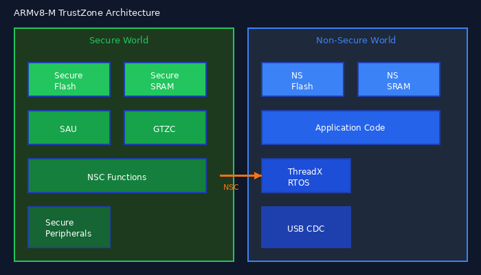

.. _trustzone_emulation:

====================
TrustZone Emulation
====================

This tutorial covers emulating ARMv8-M TrustZone firmware with Secure and
Non-Secure worlds.

TrustZone Architecture
======================

ARMv8-M TrustZone provides hardware isolation between two security domains:

   TrustZone: Secure and Non-Secure worlds with SAU/IDAU partitioning

**Key Concepts:**

- **Secure World**: Privileged access to all memory and peripherals
- **Non-Secure World**: Restricted access based on SAU configuration
- **SAU (Security Attribution Unit)**: Configures memory region security
- **NSC (Non-Secure Callable)**: Secure functions callable from Non-Secure
- **IDAU (Implementation Defined AU)**: Fixed security aliases

Memory Map with TrustZone
=========================

STM32H563 example memory layout:

.. code-block:: text

   Address Range           | Security    | Description
   ─────────────────────────────────────────────────────────
   0x0C000000 - 0x0C03FFFF | Secure      | Secure Flash (256KB)
   0x08000000 - 0x0807FFFF | Non-Secure  | NS Flash alias
   0x08042000 - 0x0807FFFF | Non-Secure  | NS Application
   ─────────────────────────────────────────────────────────
   0x30000000 - 0x3003FFFF | Secure      | Secure SRAM (256KB)
   0x20000000 - 0x2003FFFF | Non-Secure  | NS SRAM alias
   ─────────────────────────────────────────────────────────
   0x50000000 - 0x5FFFFFFF | Secure      | Secure Peripherals
   0x40000000 - 0x4FFFFFFF | Non-Secure  | NS Peripheral alias

Configuring QEMU for TrustZone
==============================

Use the ``trustzone=on`` option:

.. code-block:: bash

   qemu-system-arm \
       -M slab-cortex-m,cpu-type=cortex-m33,trustzone=on,flash-base=0x0C000000,sram-base=0x30000000 \
       -kernel secure_fw.bin \
       -device loader,file=nonsecure_fw.bin,addr=0x08042000 \
       -nographic

**Options:**

- ``trustzone=on``: Enable TrustZone security extensions
- ``flash-base=0x0C000000``: Secure Flash base address
- ``sram-base=0x30000000``: Secure SRAM base address
- ``-device loader,addr=0x08042000``: Load NS firmware at NS address

Peripheral Server with TrustZone
================================

The peripheral proxy protocol includes security state:

.. code-block:: python

   class TrustZonePeripheralServer:
       """Peripheral server with Secure/Non-Secure handling."""

       def __init__(self):
           self.secure_ps = STM32H563PeripheralSet()
           self.ns_ps = STM32H563PeripheralSet()

       def read(self, address: int, size: int, secure: bool) -> tuple:
           """Handle read with security state."""

           # Check address range
           if (address >> 28) == 0x5:
               # Secure peripheral access (0x5xxxxxxx)
               if not secure:
                   # Non-Secure access to Secure peripheral
                   return (0, 2)  # Security fault
               # Map to non-secure alias for processing
               ns_addr = address - 0x10000000
               return self.secure_ps.read(ns_addr, size)

           elif (address >> 28) == 0x4:
               # Non-Secure peripheral access (0x4xxxxxxx)
               return self.ns_ps.read(address, size)

           return (0, 1)  # Error

       def write(self, address: int, size: int, value: int, secure: bool) -> int:
           """Handle write with security state."""

           if (address >> 28) == 0x5:
               if not secure:
                   return 2  # Security fault
               ns_addr = address - 0x10000000
               return self.secure_ps.write(ns_addr, size, value)

           elif (address >> 28) == 0x4:
               return self.ns_ps.write(address, size, value)

           return 1

Handling Security Transitions
=============================

The protocol includes security state in each request:

.. code-block:: python

   async def handle_qemu(reader, writer, ps):
       while True:
           hdr = await reader.read(9)
           if len(hdr) < 9:
               break

           cmd = hdr[0]
           # cmd: 'R'=NS read, 'W'=NS write, 'S'=Secure read, 'T'=Secure write
           secure = cmd in (ord('S'), ord('T'))

           addr = int.from_bytes(hdr[1:5], "little")
           sz = int.from_bytes(hdr[5:9], "little")

           if cmd in (ord('R'), ord('S')):  # Read
               await reader.read(1)
               val, status = ps.read(addr, sz, secure)
               writer.write(struct.pack('<IB', val, status))
           else:  # Write
               data = await reader.read(5)
               val = int.from_bytes(data[:4], "little")
               status = ps.write(addr, sz, val, secure)
               writer.write(struct.pack('<IB', 0, status))

           await writer.drain()

STM32H563 TrustZone Example
===========================

The example firmware includes Secure and Non-Secure components:

Secure World (secure_fw.bin)
----------------------------

.. code-block:: c
   :caption: Secure/Src/main.c

   #include "main.h"

   int main(void)
   {
       // Initialize HAL
       HAL_Init();

       // Configure system clock (168 MHz)
       SystemClock_Config();

       // Configure SAU regions
       SAU_Config();

       // Configure GTZC (Global TrustZone Controller)
       GTZC_Config();

       // Initialize secure UART for debug
       UART_Init();
       UART_Print("[SECURE] Secure world started\r\n");

       // Jump to Non-Secure world
       Jump_To_NonSecure();

       // Should never reach here
       while (1);
   }

   void SAU_Config(void)
   {
       // Region 0: Non-Secure Flash (0x08000000 - 0x0807FFFF)
       SAU->RNR = 0;
       SAU->RBAR = 0x08000000;
       SAU->RLAR = 0x0807FFE1;  // Enable, NS

       // Region 1: Non-Secure SRAM (0x20000000 - 0x2003FFFF)
       SAU->RNR = 1;
       SAU->RBAR = 0x20000000;
       SAU->RLAR = 0x2003FFE1;

       // Region 2: Non-Secure peripherals (0x40000000 - 0x4FFFFFFF)
       SAU->RNR = 2;
       SAU->RBAR = 0x40000000;
       SAU->RLAR = 0x4FFFFFE1;

       // Enable SAU
       SAU->CTRL = SAU_CTRL_ENABLE_Msk;
   }

   void Jump_To_NonSecure(void)
   {
       // Set NS vector table
       SCB_NS->VTOR = 0x08042000;

       // Get NS entry point
       uint32_t ns_sp = *(uint32_t*)0x08042000;
       uint32_t ns_pc = *(uint32_t*)0x08042004;

       // Set NS stack pointer
       __TZ_set_MSP_NS(ns_sp);

       // Jump to NS (clears LSB for NS entry)
       ((void (*)(void))(ns_pc & ~1))();
   }

Non-Secure Callable (NSC) Functions
-----------------------------------

.. code-block:: c
   :caption: Secure_nsclib/secure_nsc.c

   #include "secure_nsc.h"

   // Non-Secure Callable function: Print via secure UART
   __attribute__((cmse_nonsecure_entry))
   void SECURE_UART_Print(const char *msg, uint32_t len)
   {
       // Validate NS pointer
       if (cmse_check_address_range((void*)msg, len, CMSE_NONSECURE) == NULL) {
           return;  // Security violation
       }

       // Call secure UART
       for (uint32_t i = 0; i < len; i++) {
           USART1->TDR = msg[i];
           while (!(USART1->ISR & USART_ISR_TXE));
       }
   }

Non-Secure World (nonsecure_fw.bin)
-----------------------------------

.. code-block:: c
   :caption: NonSecure/Src/main.c

   #include "main.h"
   #include "secure_nsc.h"  // NSC function declarations

   int main(void)
   {
       // HAL init (Non-Secure)
       HAL_Init();

       // GPIO init
       MX_GPIO_Init();

       // Print via secure UART (NSC call)
       SECURE_UART_Print("[NON-SECURE] Application started\r\n", 36);

       // Initialize USB CDC
       MX_USB_Init();

       // Main loop
       while (1) {
           // USB CDC polling
           USB_Process();

           // Blink LED
           HAL_GPIO_TogglePin(GPIOG, GPIO_PIN_0);
           HAL_Delay(500);
       }
   }

Running the TrustZone Example
=============================

1. Build the firmware:

.. code-block:: bash

   cd slab/examples/cortex-m/stm32/h563/stm32h563_tz_cdc
   make

2. Start the peripheral server:

.. code-block:: bash

   PYTHONPATH=slab/python python3 slab/python/slab_cortex_m/mcuemu_server.py \
       --port 5555 --board slab/boards/stm32h563_tz.yaml

3. Run QEMU:

.. code-block:: bash

   ./build/qemu-system-arm \
       -M slab-cortex-m,cpu-type=cortex-m33,flash-base=0x0C000000,sram-base=0x30000000,sram-size=0xa0000,trustzone=on \
       -kernel build/secure_fw.bin \
       -device loader,file=build/nonsecure_fw.bin,addr=0x08042000 \
       -nographic

Expected output::

   [SECURE] Secure world started
   [SECURE] SAU configured
   [SECURE] Jumping to Non-Secure...
   [NON-SECURE] Application started
   [NON-SECURE] USB CDC initialized

Debugging TrustZone Boot
========================

Common issues:

1. **SAU misconfiguration**: NS code can't access required memory
2. **GTZC blocking**: Peripheral access denied
3. **Wrong NS vector table**: Crash on NS entry
4. **NSC signature missing**: Security fault on NS→S transition

Use tracing to diagnose:

.. code-block:: python

   def trace_security(address: int, secure: bool, operation: str):
       region = "SECURE" if (address >> 28) == 0x5 or (address >> 28) >= 0xC else "NS"
       caller = "S" if secure else "NS"
       print(f"[{caller}→{region}] {operation} 0x{address:08X}")

Output::

   [S→SECURE] WRITE 0x50000000 (SAU config)
   [S→SECURE] WRITE 0x50020000 (GTZC config)
   [S→NS] WRITE 0xE002ED08 (VTOR_NS)
   [NS→NS] READ  0x08042000 (NS SP)
   [NS→NS] READ  0x08042004 (NS PC)
   [NS→NS] READ  0x40020000 (GPIO)

Next Steps
==========

* :ref:`api/slab_stm32` - STM32H5 peripheral API
* :ref:`debugging_bootloops` - Debug TZ boot issues
* :ref:`creating_ui_peripherals` - Visualize S/NS transitions
